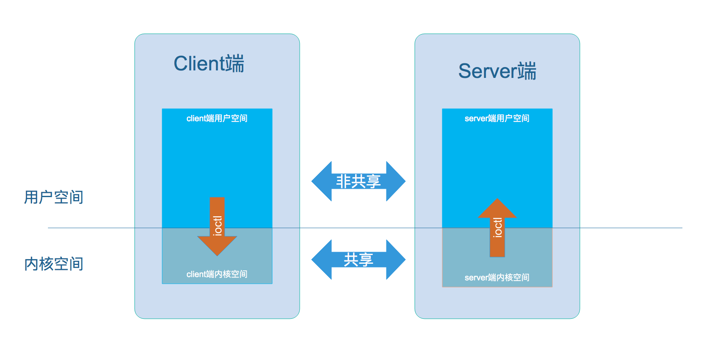
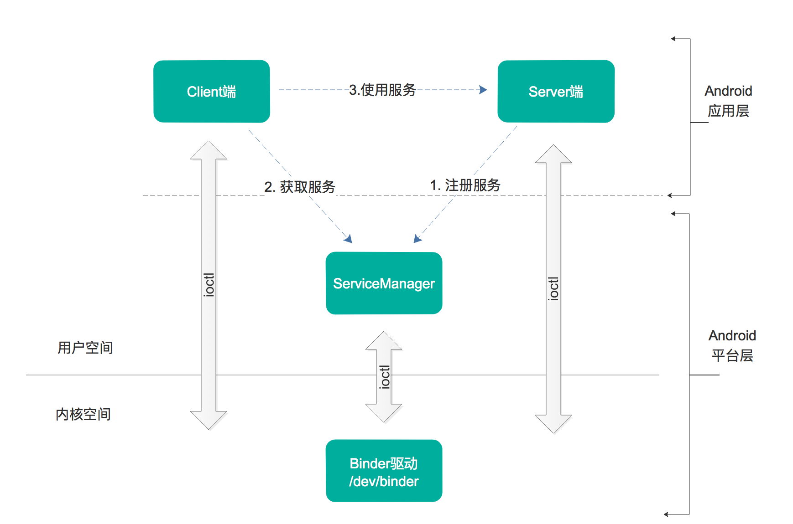
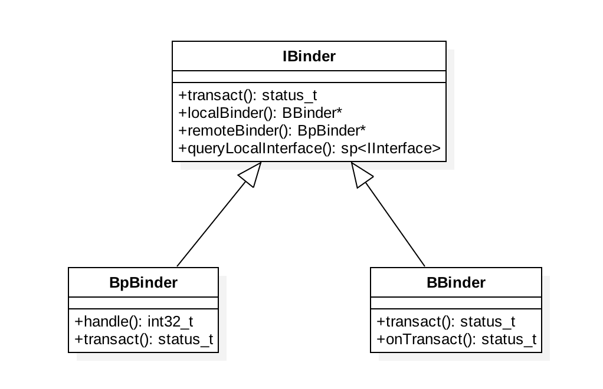

[TOC]

# Binder系列-开篇

## 一、概述
Android系统中，每个应用程序是由Android的`Activity`,`Service`,`Broadcast`,`ContentProvider`这四剑客中一个或者多个组合而成，这四剑客所涉及的多进程间的通信底层都是依赖于Binder IPC机制。例如当进程A中Activity要像向B中的Service通信，这便需要依赖于Binder IPC。不仅于此，整个Android系统架构中，大量采用了Binder机制作为IPC(Inter Process Communication)方案，当然也存在部分其他的IPC方式，共享内存，消息传递，套接字等，比如Zygote通信便采用的是socket。

Binder作为Android系统提供的一种IPC机制，无论从事系统开发还是应用开发，都应该有所了解，这是Android系统的最重要的组成，也是最难理解的一块知识点，错综复杂。要深入了解Binder机制，最好的方法便是阅读源码，借用Linux鼻祖Linus Torvalds曾说过的一句话： `Read The Fucking Source Code`

## 二、Binder
### 2.1 IPC原理
从进程的角度来看IPC机制 



每个Android的进程，只能运行在自己进程所拥有的虚拟地址空间。对应一个4GB的虚拟地址空间，其中3GB是用户空间，1GB是内核空间，当然内核空间的大小是可以通过参数配置调整的。对于用户空间，不同进程之间彼此是不能共享的，而内容空间却是可以共享的。Client进程向Server进程通信，恰恰是利用进程间可共享的内核空间来完成底层通信工作的，Client端与Server端进程旺旺是采用ioctl等方法跟内核空间的驱动进行交互。
> ioctl，Input Output ConTrol，是设备驱动程序中对设备的I/O通道进行管理的函数，提供了一种获得设备信息和向设备发送控制参数的手段。

### 2.2 Binder原理
Binder通信采用C/S架构，从组件视角来说，包含Client、Server、ServiceManager以及Binder驱动，其中ServiceManager用于管理系统中的各种服务。架构图如下所示：



可以看出无论是注册服务和获取服务的过程都需要ServiceManager，需要注意的是此处ServiceManger是指Native层的ServiceManger(C++)，并非指framework层的ServiceManger(Java)。ServiceManger是整个Binder通信机制的大管家，是Android进程间通信机制Binder的守护进程，要掌握Binder机制，首先要了解系统是如何首次启动ServiceManger。当ServiceManger启动之后，Client端和Server端通信时都需要先获取ServiceManger接口，才能开始通信服务。

图中Client/Server/ServiceManger之间相互通信都是基于Binder机制，既然基于Binder机制通信，那么同样也是C/S架构，则图中的3大步骤都有相应的Client端和Server端。

1. **注册服务(addService)**：Service进程要先注册Service到ServiceManager。该过程Server是客户端，ServiceManger是服务端。
2. **获取服务(getService)**：Client进程使用某个Service前，需先向ServiceManager中获取相应的Service。该过程：Client是客户端，ServiceManger是服务端。
3. **使用服务**：Client根据得到的Service信息建立与Service所在的Server进程通信的通路，然后就可以直接与Service交互。该过程：Client是客户端，Server是服务端。

图中的Client，Server，ServiceManger之间交互都是虚线表示，是由于他们彼此之间不是直接交互的，而是都通过与Binder驱动进行交互的，从而实现IPC通信方式。其中Binder驱动位于内核空间，Client，Server，ServiceManger位于用户。Binder驱动和ServiceManger可以看做是Android平台的基础架构，而Client和Server是Android的应用层，开发人员只需要自定义实现Client、Server端，借助Android的基本平台框架便可以直接进行IPC通信。

### 2.3 C/S模式
BpBinder(客户端 /frameworks/native/libs/binder/BpBinder.cpp)和BBinder(服务端 /frameworks/native/include/binder/Binder.cpp)都是Android中Binder相关的代表，它们都是从IBinder(/frameworks/native/include/binder/IBinder.h)类中派生而来，关系图如下：



* Client端：BpBinder.transact()来发送事物请求
* Server端：BBinder.onTransact()会接收到相应事物

##三、源码目录
从上到下，整个Binder架构所涉及的总共有以下5个目录：

```
/framework/base/core/java/                  (Java)
/framework/base/core/jni/                   (JNI)
/framework/native/libs/binder               (Native)
/framework/native/cmds/servicemanager       (Native)
/kernel/drivers/staging/android             (Driver)
```

### 3.1 Java framework

```
/framework/base/core/java/android/os/
    - IInterface.java
    - IBinder.java
    - Parcel.java
    - IServiceManager.java
    - ServiceManager.java
    - ServiceManagerNative.java
    - Binder.java
```
```
/framework/base/core/jni/
    - android_os_Parcel.cpp
    - AndroidRuntime.cpp
    - android_util_Binder.cpp           (核心类)
```

### 3.2 Native framework

```
/framework/native/libs/binder/
    - IServiceManager.cpp
    - BpBinder.cpp
    - Binder.cpp
    - IPCThreadState.cpp                (核心类)
    - ProcessState.cpp                  (核心类）
```
```
/framework/native/include/binder/
    - IServiceManager.h
    - IInterface.h
```
```
/framework/native/cmds/servicemanager
    - service_maneger.c
    - binder.c 
```

### 3.3 Kernel
驱动层的原路径（这部分代码不再AOSP中，而是在Linux内核代码中) 参考：https://www.jianshu.com/p/2efc0971c3e0

```
/kernel/drivers/staging/android
    - binder.c
    - uapi/binder.h
```

