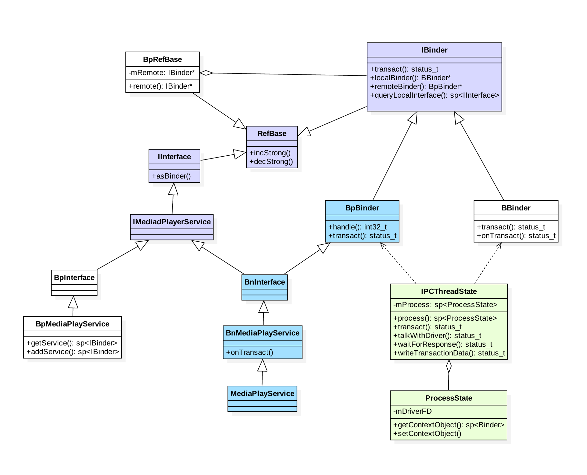
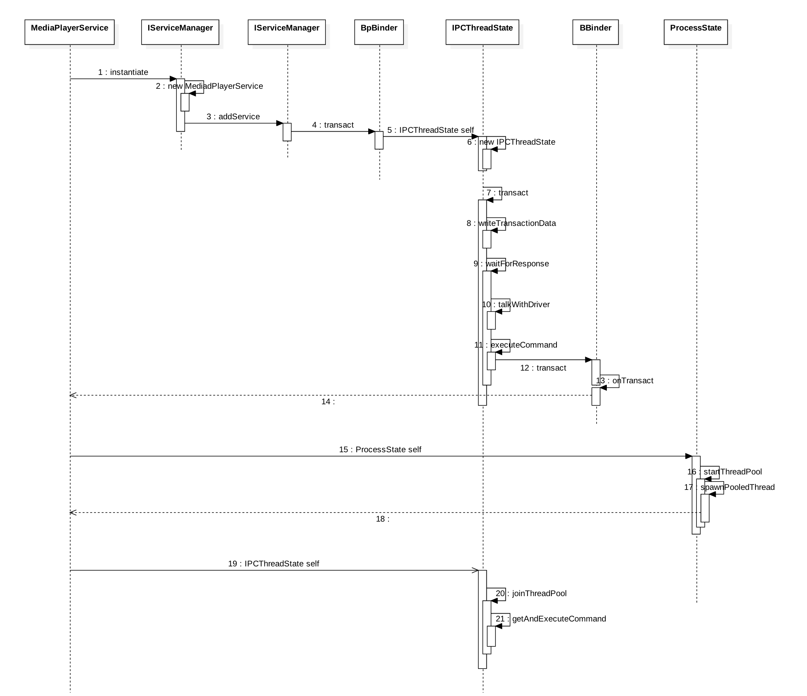
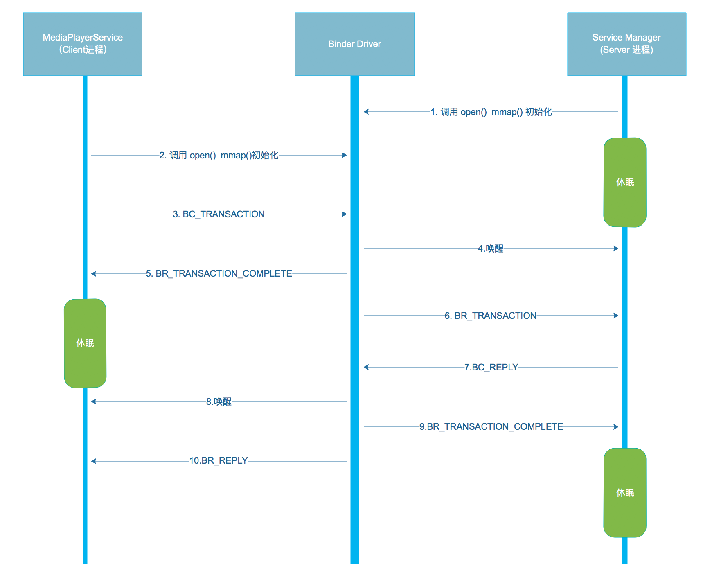

[TOC]

# Binder 系列 - 注册服务

> 基于Android6.0的源码剖析，本文讲解如何向ServiceManager注册Native层的服务过程

```
/framework/native/libs/binder
    - Binder.cpp
    - BpBinder.cpp
    - IPCThreadState.cpp
    - ProcessState.cpp
    - IServiceManager.cpp
    - IInterface.cpp
    - Parcel.cpp

/framework/native/include/binder/
    - IInterface.h  (包括BnInterface，BpInterface)
```

## 一、概述
### 1.1 media服务注册

media入口函数是 main_mediaserver.cpp 中的 main() 方法，代码如下：

```
/frameworks/av/media/mediaserver/main_mediaserver.cpp

int main(int argc __unused, char** argv)
{
       ···
       InitializeIcuOrDie();
       
       // 获取ProcessState实例对象 【见小节2.1】
       sp<ProcessState> proc(ProcessState::self());
       
       // 获取BpServiceManager对象
       sp<IServiceManager> sm = defaultServiceManager();
       ALOGI("ServiceManager: %p", sm.get());
       
       // 注册多媒体服务   【见小节3.1】
       AudioFlinger::instantiate();
       MediaPlayerService::instantiate();
       ResourceManagerService::instantiate();
       CameraService::instantiate();
       AudioPolicyService::instantiate();
       SoundTriggerHwService::instantiate();
       RadioService::instantiate();
       registerExtensions();
       
       // 启动Binder线程池
       ProcessState::self()->startThreadPool();
       
       // 当前线程加入到线程池
       IPCThreadState::self()->joinThreadPool();
}

```

过程说明：

1. 获取ServiceManager：讲解了defaultServiceManager()返回的是BpServiceManger对象，用于跟ServiceManager进程通信；

2. 理解Binder线程池的管理，讲解了startThreadPool和joinThreadPool过程

本文重点讲解Native层服务注册的过程

### 1.2 类图

在Native层的服务以media服务为例，来说一说服务注册过程，先来看看那media整个类的关系图



图解：

* 蓝色：注册MediaPlayerService服务所涉及的类
* 绿色：Binder架构中与Binder驱动通信过程中的最为核心的俩个类
* 紫色：注册服务和获取服务的公共接口/父类

### 1.3 时序图

先通过一幅图来说说，media服务启动过程是如何向servicemanager注册服务的



## 二、ProcessSate
### 2.1 ProcessSate::self

```
/frameworks/native/libs/binder/ProcessState.cpp

sp<ProcessSate> ProcessSate::self()
{
    Mutex::Autolock _l(gProcessMutex);
    if (gProcess != NULL) {
        return gProcess;
    }
    gProcess = new ProcessState;
    return gProcess;
}
```

获得ProcessSate对象：这也是单例模式，从而保证每一个进程只有一个 `ProcessSate` 对象，其中 `gProcess` 和 `gProcessMutex` 是保存在 `Static.cpp` 类的全局变量。

### 2.2 ProcessSate初始化

```
/frameworks/native/libs/binder/ProcessState.cpp

ProcessState::ProcessState()
    : mDriverFD(open_driver()) // 打开驱动【见小节2.3】
    , mVMStart(MAP_FAILED)
    , mThreadCountLock(PTHREAD_MUTEX_INITIALIZER)
    , mThreadCountDecrement(PTHREAD_COND_INITIALIZER)
    , mEexcutingThreadsCount(0)
    , mManagerContexts(false)
    , mBinderContextCheckFunc(NULL)
    , mBinderContextUserDate(NULL)
    , mThreadPoolStarted(false)
    , mThreadPoolSeq(1)
{
    if (mDriverFd >= 0) {
        // 采用内存映射函数mmp，给binder分配一块虚拟地址空间【见小节2.4】
        # if !defined(HAVE_WIN32_IPC)
        mVMStart = mmap(0,BINDER_VM_SIZE,PROT_READ,MAP_PRIVATE | MAP_NORESERVE, mDriverFD, 0);
        if (mVMStart == MAP_FAILED) {
            // 没有足够空间分配给 /dev/binder，则关闭驱动
            ALOGE("Using /dev/binder failed: unable to mmap transaction memory .\n");
            close(mDriverFD);
            mDriverFD = -1;
        }
        # else 
            mDriverFD =  -1;
        # endif
    }
    LOG_ALWAYS_FATAL_IF(mDriverFD < 0,"Binder driver could not be opened. Terminating");
}   
    
```

* `ProcessSate` 的单例模式的唯一性，因此一个进程只打来binder设备一次，其中ProcessSate的成员变量 `mDricerFD` 记录binder驱动的fd，用于访问binder设备。
* `BINDER_VM_SIZE = (1*1024*1024) - (4096*2)`，binder分配的默认内存大小为1M-8K。
* `DEFAULT_MAX_BINDER_THREADS = 15`，binder默认的最大可并发访问线程数为16。

### 2.3 open_driver

```
/frameworks/native/libs/binder/ProcessState.cpp

static int open_driver()
{
    // 打开/dev/binder设备，建立与内核的Binder驱动的交互通道
    int fd = open("/dev/binder", O_RDWR);
    if (fd >= 0) {
        fcntl(fd, F_SETFD, FD_CLOEXEC);
        int vers = 0;
        status_t result = ioctl(fd, BINDER_VERSION, &vers);
        if (result == -1) {
            close(fd);
            fd = -1;
        }
        if (result != 0 || vers != BINDER_CURRENT_PROTOCOL_VERSION) {
            close(fd);
            fd = -1;
        }
        size_t maxThreads = DEFAULT_MAX_BINDER_THREADS;

        // 通过ioctl设置binder驱动，能支持的最大线程数
        result = ioctl(fd, BINDER_SET_MAX_THREADS, &maxThreads);
        if (result == -1) {
            ALOGE("Binder ioctl to set max threads failed: %s", strerror(errno));
        }
    } else {
        ALOGW("Opening '/dev/binder' failed: %s\n", strerror(errno));
    }
    return fd;
}
```

open_driver作用是打开/dev/binder设备，设定binder支持的最大线程数。关于binder驱动的响应方法，见文章 Binder Driver初探。

ProcessState采用单例模式，保证每一个进程都只打开一次Binder Driver。

### 2.4 mmap

```
// 原型
void* mmap(void* addr, size_t size, int prot, int flags, int fd, off_t offset);
// 此处
mmap(0, BINDER_VM, PROT_READ, MAP_PRIVATE | MAP_NORESERVE, mDriverFD, 0);
```

参数说明：

* addr：代表映射到进程空间的起始地址，当值等于0则由内核选择合适地址，此处为0；
* size：代表需要映射的内存地址空间的大小，此处为1M-8k；
* prot：代表内存映射区的读写等属性值，此处为PROT_READ(可读取)；
* flags：标志位，次吃为MAP_PRIVATE(私有映射，多进程间不共享内容的改变)和MAP_NORESERVE(不保留交换空间)；
* fd：代表mmap所保留的文件描述符，此处为mDriverFD；
* offset：偏移量，此处为0；

mmap() 经过系统调用，执行binder_mmap过程

## 三、服务注册
### 3.1 instantiate

```
/frameworks/av/media/libmediaplayerservice/MediaPlayerService.cpp

void MediaPlayerService::instantiate() {
   defaultServiceManager()->addService(
           String16("media.player"), new MediaPlayerService());
}
```

注册服务MediaPlayerService：由defaultServiceManager返回的是BpServiceManager，同时会创建ProcessState对象和BpBinder对象。故此处等价于调用BpServiceManager->addService。其中MediaPlayer位于libmediaplayerservice库。

### 3.2 BpServiceManager.addService

```
/frameworks/native/libs/binder/IServiceManager.cpp

virtual status_t addService(const String16& name, const sp<IBinder>& service,
           bool allowIsolated)
   {
        //Parcel是数据通信包
       Parcel data, reply;
       // 写入头信息“android.os.IServiceManager”
       data.writeInterfaceToken(IServiceManager::getInterfaceDescriptor());
       // name 为“media.player”
       data.writeString16(name);
       // MediaPlayerService对象【见小节3.2.1】
       data.writeStrongBinder(service);
       // allowIsolated = false
       data.writeInt32(allowIsolated ? 1 : 0);
       // remote()指向的是BpBinder对象【见小节3.3】
       status_t err = remote()->transact(ADD_SERVICE_TRANSACTION, data, &reply);
       return err == NO_ERROR ? reply.readExceptionCode() : err;
   }
```

服务注册过程：向ServiceManager注册服务MediaPlayerService，服务名为“media.player”;

#### 3.2.1 writeStrongBinder

```
/frameworks/native/libs/binder/Parcel.cpp

status_t Parcel::writeStrongBinder(const sp<IBinder>& val)
{
   return flatten_binder(ProcessState::self(), val, this);
}
```

#### 3.2.2 flatten_binder

```
/frameworks/native/libs/binder/Parcel.cpp

status_t flatten_binder(const sp<ProcessState>& /*proc*/,
   const sp<IBinder>& binder, Parcel* out)
{
   flat_binder_object obj;

   obj.flags = 0x7f | FLAT_BINDER_FLAG_ACCEPTS_FDS;
   if (binder != NULL) {
        // 本地Binder不为空
       IBinder *local = binder->localBinder();
       if (!local) {
           BpBinder *proxy = binder->remoteBinder();
           if (proxy == NULL) {
               ALOGE("null proxy");
           }
           const int32_t handle = proxy ? proxy->handle() : 0;
           obj.type = BINDER_TYPE_HANDLE;
           obj.binder = 0; /* Don't pass uninitialized stack data to a remote process */
           obj.handle = handle;
           obj.cookie = 0;
       } else {
            // 进入该分支
           obj.type = BINDER_TYPE_BINDER;
           obj.binder = reinterpret_cast<uintptr_t>(local->getWeakRefs());
           obj.cookie = reinterpret_cast<uintptr_t>(local);
       }
   } else {
       obj.type = BINDER_TYPE_BINDER;
       obj.binder = 0;
       obj.cookie = 0;
   }
    // 【见小节3.2.3】
   return finish_flatten_binder(binder, obj, out);
}
```

将Binder对象扁平化，转换为flat_binder_object对象
。

* 对象Binder实体，则cookie记录Binder实体的指针；
* 对于Binder代理，则用handle记录Binder代理的句柄；

关于localBinder，代码见Binder.cpp

```
/frameworks/native/libs/binder/Binder.cpp

BBinder* BBinder::localBinder()
{
    return this;
}

BBinder* IBinder::localBinder()
{
    return NULL;
}

```

#### 3.2.3 finish_faltten_binder

```
    inline static status_t finish_flatten_binder(
        const sp<IBinder>& , const flat_binder_object& flat,Parel* out)
        {
            reutrn out->writeObject(flat, false);
        }
```

将flat_binder_object写入out

### 3.3 BpBinder::transact

```
/frameworks/native/libs/binder/BpBinder.cpp

status_t BpBinder::transact(
    uint32_t code, const Parcel& data, Parcel* reply, uint32_t flags)
{
    if (mAlive) {
        // code=ADD_SERVICE_TRANSACTION【见小节3.4】
        status_t status = IPCThreadState::self()->transact(
            mHandle, code, data, reply, flags);
        if (status == DEAD_OBJECT) mAlive = 0;
        return status;
    }
    return DEAD_OBJECT;
}
```

Binder代理类调用transact()方法，真正工作还是交给IPCThreadState来进行transact工作，先来看看IPCThreadState::self的过程。

#### 3.3.1 IPCThreadState::self

```
/frameworks/native/libs/binder/IPCThreadState.cpp

IPCThreadState* IPCThreadState::self()
{
    if(gHaveTLS){
        restart:
        const pthread_key_t k = gTLS;
        IPCThreadState* st = (IPCThreadState*)pthread_getspecific(k);
        if (st) return st;
        return new IPCThreadState;
    }
    
    if (gShutdown) return NULL;
    
    pthread_mutex_lock(&gTLSSMutex);
    if(!gHaveTLS){
        if(pthread_key_create(&gTLS,threadDestructor)!=0){
            pthread_mutex_unlock(&gTLSMutex);
            return NULL;
        }
        gHaveTLS = true;
    }
    pthread_mutex_unlock(&gTLSMutex);
    goto restart;
}
```

TLS是指Thread local storage(线程本地储存空间)，每个线程都拥有自己的TLS，并且是私有空间，线程之间不会共享，通过pthread_getspecific/pthread_setspecific函数可以获取/设置这些空间中的内容。从线程本地存储空间获得保存在其中的IPCThreadState对象。

#### 3.3.2 IPCThreadState初始化

```
/frameworks/native/libs/binder/IPCThreadState.cpp

IPCThreadState::IPCThreadState()
    :mProcess(ProcessState::self()),
    mMyThreadId(gettid()),
    mStrictModePolicy(0),
    mLastTransactionBinderFlags(0)
{
    pthread_setspecific(gTLS,this);
    clearCaller();
    mIn.setDataCapacity(256);
    mOut.setDataCapacity(256);    
}
```

每个线程都有一个IPCThreadState，每个IPCThreadState中都偶有一个mIn，mOut。成员变量mProcess保存了ProcessState变量（每个进程只有一个）

* mIn用来接收来自Binder设备的数据，默认大小为256字节
* mOut用来存储发往Binder设备的数据，默认大小为256字节

### 3.4 IPC::transact

```
/frameworks/native/libs/binder/IPCThreadState.cpp

status_t IPCThreadState::transact(int32_t handle, unit32_t code, const Parcel& data, Parcel* replay, unit32_t flags)
{
    status_t err = data.errorCheck();//数据错误检查
    flags |= TF_ACCEPT_FDS;
    ···
    if(err == NO_ERROR) { //传输数据【见小节3.5】
        err = writeTransactionData(BC_TRANSACTION,flags,handle,code,data,NULL);
    }
    ···
    
    ((flags & TF_ONE_WAY) == 0){
        if(reply){
            //等待响应 【见小节3.6】
            err = waitForResponse(reply);
        }else{
            Parcel fakeReply;
            err = waitForResponse(&fakeReply);
        }
    }else{
        //oneway，则不需要等待replay的场景
        err = waitForResponse(NULL,NULL);
    }
    return err;
}
```

IPCThreadState进行transact事物处理分3部分：

* errorCheck() //数据错误检查
* writeTransactionData()//传输数据
* waitForResponse()//等待响应

### 3.5 IPC.writeTranactionData

```
/frameworks/native/libs/binder/IPCThreadState.cpp

status_t IPCThreadState::writeTransactionData(int32_t cmd, unit32_t binderFlags, int32_t handle, unit32_t code, const Parcel& data,status_t* statusBuffer){
    binder_transaction_data tr;
    
    tr.target.ptr = 0;
    tr.target.handle = handle;  //handle = 0;
    tr.code = code;             // code = ADD_SERVICE_TRANSACTION
    tr.flags = binderFlags;     //binderFlags = 0
    tr.cookie = 0;
    tr.sender_pid = 0;
    tr.sender_euid = 0;
    
    // data为记录Media服务信息的Parcel对象
    const status_t err = data.errorCheck();
    if(err == NO_ERROR){
        tr.data_size = data.ipcDataSize();
        tr.data.ptr.buffer = data.ipcData();
        tr.offsets_size = data.ipcObjectCount()*sizeof(binder_size_t);
        tr.data.ptr.offsets = data.ipcObjects();
        
    }else if(statusBuffer){
        tr.flags |= TF_STATUS_CODE;
        *statusBuffer = err;
        tr.data_size = sizeof(status_t);
        tr.data.ptr.buffer = reinterpret_cast<unitptr_t>(statusBuffer);
        tr.offsets_size = 0;
        tr.data.ptr.offsets = 0;
        
    }else{
        return (mLastError == err);
    }
    
    mOut.writeInt32(cmd);
    mOut.write(&tr,sizeOf(tr));
    
    return NO_ERROR;
}
```

其中handle的值用来标识目的端，注册服务过程的目的端为service manager，此处handle=0所对应的是binder_context_mgr_node对象，正是service manager所对应的binder实体对象。binder_transaction_data结构体是binder驱动通信的数据结构，该过程最终是把Binder请求码BC_TRANSACTION和binder_transaction_data结构体写入mOut。

transaction过程，先写完binder_transaction_data数据，其中Parcel data的重要成员变量：
    
* mDataSize：保存在data_size, binder_transaction的数据大小
* mData：保存在ptr.buffer, binder_transaction的数据的其实地址
* mObjectSize：保存在ptr.offsets_size,记录着flat_binder_object结构体的个数；
* MObject：保存在offsets，记录着flat_binder_object结构体数据偏移量；

接下来执行waitForResponse()方法

### 3.6 IPC.waitForResponse

```
/frameworks/native/libs/binder/IPCThreadState.cpp

status_t IPCThreadState::waitForResponse(Parcel *reply, status_t *acquireResult)
{
    int32_t cmd;
    int32_t err;
    while(1){
        if((err = talkWithDriver()) < NO_ERROR) break; //【见小节3.7】
        ···
        if(mIn.dataAvail()==0) continue;
        
        cmd = mIn.readInt32();
        switch(cmd){
            case BR_TRANSACTION_COMPLETE: ···
            case BR_DEAD_REAPLY: ···
            case BR_FAILED_REPLAY: ···
            case BR_ACQUIRE_RESULT: ···
            case BR_REPLAY:
                goto finish;
            default:
                err = executeCommand(cmd);
                if(err!=NO_ERROR) goto finish;
                break;
        }
    }
    ···
    return err;
}
```

在waitForResponse过程，首先执行BR_TRANSACTION_COMPLETE；另外，目的进程收到事务后，处理BR_TRANSACTION事务，然后发送给当前进程，再执行BR_REPLAY命令。

### 3.7 IPC.talkWithDriver

```

```

binder_write_read结构体用来与Binder设备交换数据的结构，通过ioctl与mDriverFD通信，是真正与Binder驱动进行数据读写进行数据读写交互的过程。主要是操作mOut和mIn变量。

ioctl()经过系统调用后进入Binder Driver

## 四、Binder Driver
ioctl -> binder_ioctl -> binder_ioctl_write_read

### 4.1 binder_ioctl_write_read

```
```

### 4.2 binder_thread_write

```
```

### 4.3 binder_transaction

```
```

#### 4.3.1 binder_get_node

```
```

#### 4.3.2 binder_new_node

```
```

#### 4.3.3 binder_get_ref_for_node

```
```

## 五、ServiceManager

循环在binder_loop()过程，会调用binder_parse()方法

### 5.1 binder_parse

```
```

### 5.2 svcmgr_handler

```
```

### 5.3 do_add_service

```
```

### 5.4 binder_send_replay

```
```

## 六、总结

服务注册过程addService核心功能：在服务所在进程穿件binder_node，在servicemanager进程创建binder_ref。其中binder_ref的desc再同一个进程内是唯一的：
    
* 每个进程binder_proc所记录的binder_ref的handle值是从1开始递增的；
* 所有进程的binder_proc所记录的handle=0的binder_ref都指向service manager；
* 同一服务的binder_node在不同进程的binder_ref的handle值可以不同；

Media服务注册的过程涉及到MediaPlayService(作为Client进程)和Service Manager(作为Service进程)，通信流程图如下所示：



过程分析：

1. MediaPlayerService进程调用 ioctl() 向Binder驱动发送IPC数据，该过程可以理解成一个事务 binder_transaction(记为T1)，执行当前操作的线程binder_thread(记为thread1)，则 `T1 -> from_parent = NULL`, `T1 -> from = thread1`, `thread1 -> transaction_stack = T1`, 其中IPC数据内容包含：
    * Binder 协议为 BC_TRANSACTION;
    * handle等于0；
    * RPC代码为ADD_SERVICE;
    * RPC数据为“media.player”
2. Binder驱动收到该Binder请求，生成BR_TRANSACTION命令，选择目标处理该请求的线程，即ServiceManager的binder线程(记为thread2)，则 `T1 -> to_parent = NULL`, `T1 -> to_thread = thread2`。并将整个binder_transaction数据(记为T2)插入到目标线程的todo队列；
3. Service Manager的线程thread2收到T2后，调用服务注册函数将“media.player”注册到服务目录中，当服务注册完成后，生成IPC应答数据(BC_REPLY)， `T2 -> from_parent = T1`，`T2 -> from = thread2`，`thread -> transaction_stack = T2`
4. Binder驱动收到该Binder应答请求，生成BR_REPLY命令，`T2 -> to_parent = T1`，`T2 -> to_thread = thread1`，`thread -> transaction_stack = T2`。在MediaPlayerService收到命令后，知道服务注册完成后便可以正常使用。

整个过程中，BC_TRANSACTION和BR_TRANSACTION过程是一个完整的事务过程；BC_REPLYY和BR_REPLY是一个完整的事务过程。到此，其他进行便可以获取该服务，使用服务提供的方法。


