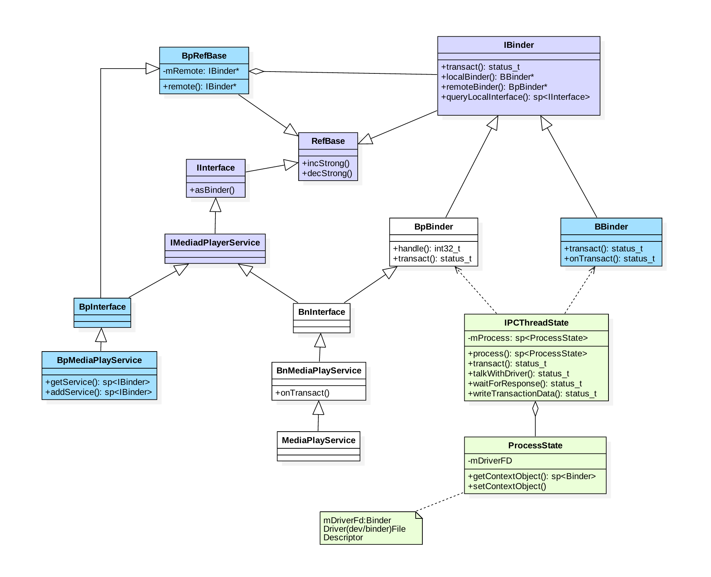

[TOC]
# Binder系列6 —— 获取服务（getService）

## 一、获取服务

在Native层的服务注册，我们选择以media为例来展开讲解，先来看看media的类关系图。

### 1.1 类图



图解：

* 蓝色：代表获取MediaPlayerService服务相关的类
* 绿色：代表Binder架构中与Binder驱动通信过程中的最为核心的俩个类
* 紫色：代表注册服务和获取服务的公共接口/父类

## 二、获取Media服务

### 2.1 getMediaPlayerService

```
/frameworks/av/media/libmedia/IMediaDeathNotifier.cpp

sp<IMediaPlayerService>&
IMediaDeathNotifier::getMediaPlayerService()
{
    Mutex::Autolock _l(sServiceLock);
    if (sMediaPlayerService == 0) {
        sp<IServiceManager> sm = defaultServiceManager(); //获取ServiceManager
        sp<IBinder> binder;
        do {
            //获取名为"media.player"的服务 【见2.2】
            binder = sm->getService(String16("media.player"));
            if (binder != 0) {
                break;
            }
            usleep(500000); // 0.5s
        } while (true);

        if (sDeathNotifier == NULL) {
            sDeathNotifier = new DeathNotifier(); //创建死亡通知对象
        }

        //将死亡通知连接到binder 【见流程14】
        binder->linkToDeath(sDeathNotifier);
        sMediaPlayerService = interface_cast<IMediaPlayerService>(binder);
    }
    return sMediaPlayerService;
}
```

其中defaultServiceManager()过程在上一篇文章获取ServiceManager已讲过，返回BpServiceManager。

在请求获取名为“media.player”的服务过程中，采用不断循环获取的方法。由于MediaPlayerService服务可能还没向ServiceManager注册完成或者尚未启动完成等情况，故则binder返回NULL，休眠0.5s后继续请求，直到获取服务为止

### 2.2 BpSM.getService

```
/frameworks/native/libs/binder/IServiceManager.cpp :: BpServiceManager

virtual sp<IBinder> getService(const String16& name) const
{
   unsigned n;
   for (n = 0; n < 5; n++){
       sp<IBinder> svc = checkService(name); //【见2.3】
       if (svc != NULL) return svc;
       sleep(1);
   }
   return NULL;
}
```

通过BpServiceManager来获取MediaPlayer服务：检索服务是否存在，当服务存在则返回相应的服务，当服务不存在则休眠1s再继续检索服务。该循环进行5次。为什么循环5次呢，这估计跟Android 的ANR时间为5s相关。如果每次都无法获取服务，循环5次，每次循环休眠1s，忽略 `checkService()` 的时间，差不多就是5s的时间

### 2.3 BpSM.checkService

```
/frameworks/native/libs/binder/IServiceManager.cpp :: BpServiceManager

virtual sp<IBinder> checkService( const String16& name) const
{
    Parcel data, reply;
    //写入RPC头
    data.writeInterfaceToken(IServiceManager::getInterfaceDescriptor());
    //写入服务名
    data.writeString16(name);
    remote()->transact(CHECK_SERVICE_TRANSACTION, data, &reply); //【见2.4】
    return reply.readStrongBinder(); //【见小节2.9】
}
```

检索指定服务是否存在，其中remote()为BpBinder

### 2.4 BpBinder::transact

```
/frameworks/native/libs/binder/BpBinder.cpp

status_t BpBinder::transact(
    uint32_t code, const Parcel& data, Parcel* reply, uint32_t flags)
{
    if (mAlive) {
        //【见流程2.5】
        status_t status = IPCThreadState::self()->transact(
            mHandle, code, data, reply, flags);
        if (status == DEAD_OBJECT) mAlive = 0;
        return status;
    }
    return DEAD_OBJECT;
}
```

Binder代理类调用transact()方法，真正工作还是交给IPCThreadState来进行transact工作

#### 2.4.1 IPCThreadState::self

```
/frameworks/native/libs/binder/IPCThreadState.cpp

IPCThreadState* IPCThreadState::self()
{
    if (gHaveTLS) {
restart:
        const pthread_key_t k = gTLS;
        IPCThreadState* st = (IPCThreadState*)pthread_getspecific(k);
        if (st) return st;
        return new IPCThreadState;  //初始IPCThreadState 【见小节2.4.2】
    }

    if (gShutdown) return NULL;
    pthread_mutex_lock(&gTLSMutex);
    if (!gHaveTLS) { //首次进入gHaveTLS为false
        if (pthread_key_create(&gTLS, threadDestructor) != 0) { //创建线程的TLS
            pthread_mutex_unlock(&gTLSMutex);
            return NULL;
        }
        gHaveTLS = true;
    }
    pthread_mutex_unlock(&gTLSMutex);
    goto restart;
}
```

TLS是指Thread local storage(线程本地储存空间)，每个线程都拥有自己的TLS，并且是私有空间，线程之间不会共享。通过pthread_getspecific/pthread_setspecific函数可以获取/设置这些空间中的内容。从线程本地存储空间中获取保存在其中的IPCThreadState对象

#### 2.4.2 IPCThreadState初始化

```
/frameworks/native/libs/binder/IPCThreadState.cpp

IPCThreadState::IPCThreadState()
    : mProcess(ProcessState::self()),
      mMyThreadId(gettid()),
      mStrictModePolicy(0),
      mLastTransactionBinderFlags(0)
{
    pthread_setspecific(gTLS, this);
    clearCaller();
    mIn.setDataCapacity(256);
    mOut.setDataCapacity(256);
}
```

每个线程都有一个 IPCThreadState，每个IPCThreadState中都有一个mIn、一个mOut。成员变量mProcess保存了ProcessState变量(每个进程只有一个)

* mIn用来接收来自Binder设备的数据，默认大小为256字节；
* mOut用来存储发往Binder设备的书，默认到校为256

### 2.5 IPCThreadState::transact

```
status_t IPCThreadState::transact(int32_t handle,
                                  uint32_t code, const Parcel& data,
                                  Parcel* reply, uint32_t flags)
{
    status_t err = data.errorCheck(); //数据错误检查
    flags |= TF_ACCEPT_FDS;
    ....
    if (err == NO_ERROR) {
         // 传输数据 【见流程2.6】
        err = writeTransactionData(BC_TRANSACTION, flags, handle, code, data, NULL);
    }

    if (err != NO_ERROR) {
        if (reply) reply->setError(err);
        return (mLastError = err);
    }

    if ((flags & TF_ONE_WAY) == 0) { //flags=0进入该分支
        if (reply) {
            //等待响应 【见流程2.7】
            err = waitForResponse(reply);
        } else {
            Parcel fakeReply;
            err = waitForResponse(&fakeReply);
        }

    } else {
        //不需要响应消息的binder则进入该分支
        err = waitForResponse(NULL, NULL);
    }
    return err;
}
```

### 2.6 IPC.writeTransactionData

```
status_t IPCThreadState::writeTransactionData(int32_t cmd, uint32_t binderFlags,
    int32_t handle, uint32_t code, const Parcel& data, status_t* statusBuffer)
{
    binder_transaction_data tr;
    tr.target.ptr = 0;
    tr.target.handle = handle; // handle = 0
    tr.code = code;            // code = CHECK_SERVICE_TRANSACTION
    tr.flags = binderFlags;    // binderFlags = 0
    tr.cookie = 0;
    tr.sender_pid = 0;
    tr.sender_euid = 0;

    // data为记录Media服务信息的Parcel对象
    const status_t err = data.errorCheck();
    if (err == NO_ERROR) {
        tr.data_size = data.ipcDataSize();  // mDataSize
        tr.data.ptr.buffer = data.ipcData(); //mData
        tr.offsets_size = data.ipcObjectsCount()*sizeof(binder_size_t); //mObjectsSize
        tr.data.ptr.offsets = data.ipcObjects(); //mObjects
    } else if (statusBuffer) {
        ...
    } else {
        return (mLastError = err);
    }

    mOut.writeInt32(cmd);         //cmd = BC_TRANSACTION
    mOut.write(&tr, sizeof(tr));  //写入binder_transaction_data数据
    return NO_ERROR;
}
```

### 未完结

## 二、总结

请求服务(getService)过程，就是向ServiceManager进程查询指定服务，当执行binder_transaction()时，会区分服务所属进程情况

1. 当请求服务的进程与服务属于不同进程，则为请求服务所在进程创建binder_ref对象，指向服务进程中的binder_node
    最终readStrongBinder()，返回的是BpBinder对象

2. 当请求服务的进程与服务属于同一进程，则不再创建新对象，只是引用计数加1，并且修改type为BINDER_TYPE_BINDER或BINDER_TYPE_WEAK_BINDER.
    最终readStrongBinder()，返回的是BBinder对象的真实子类


