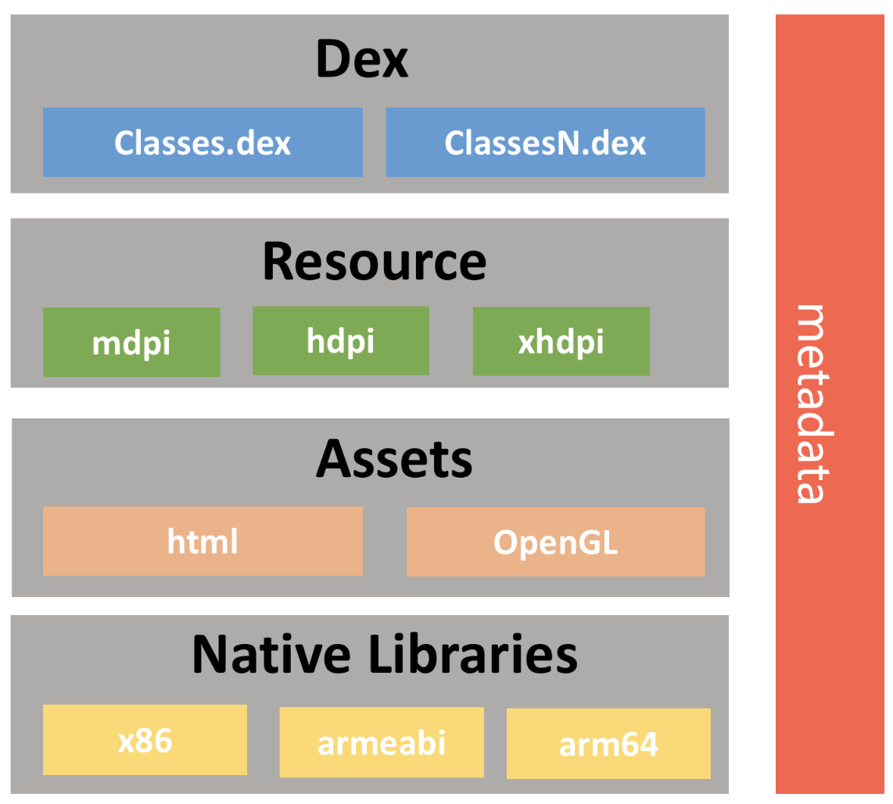
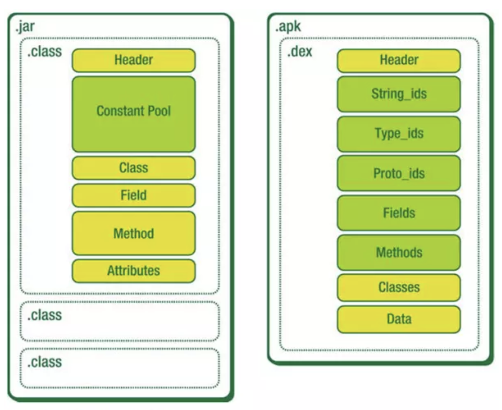
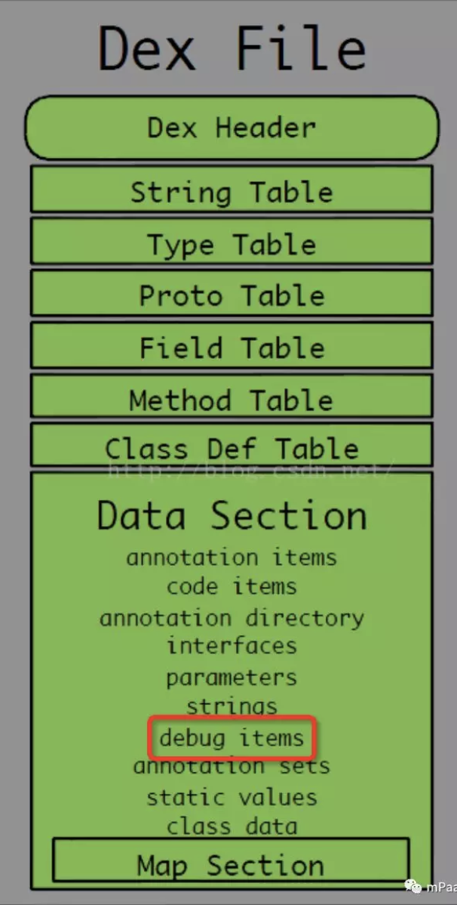
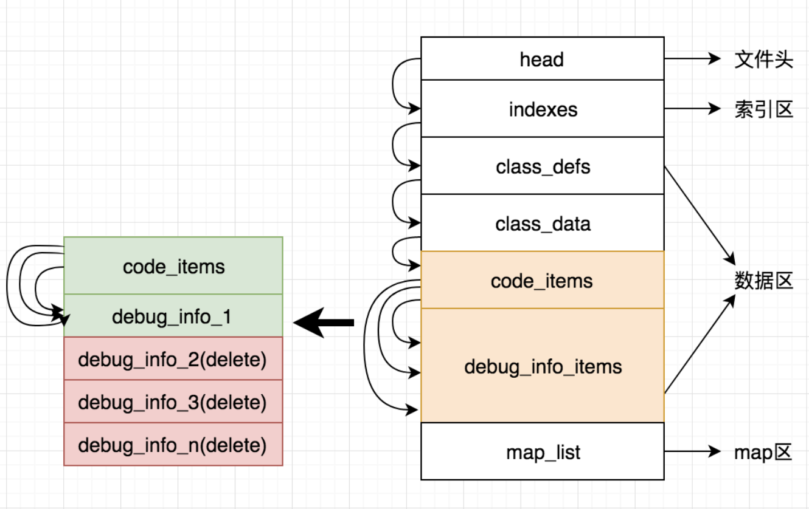
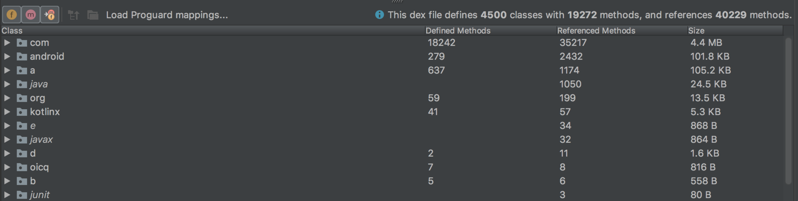
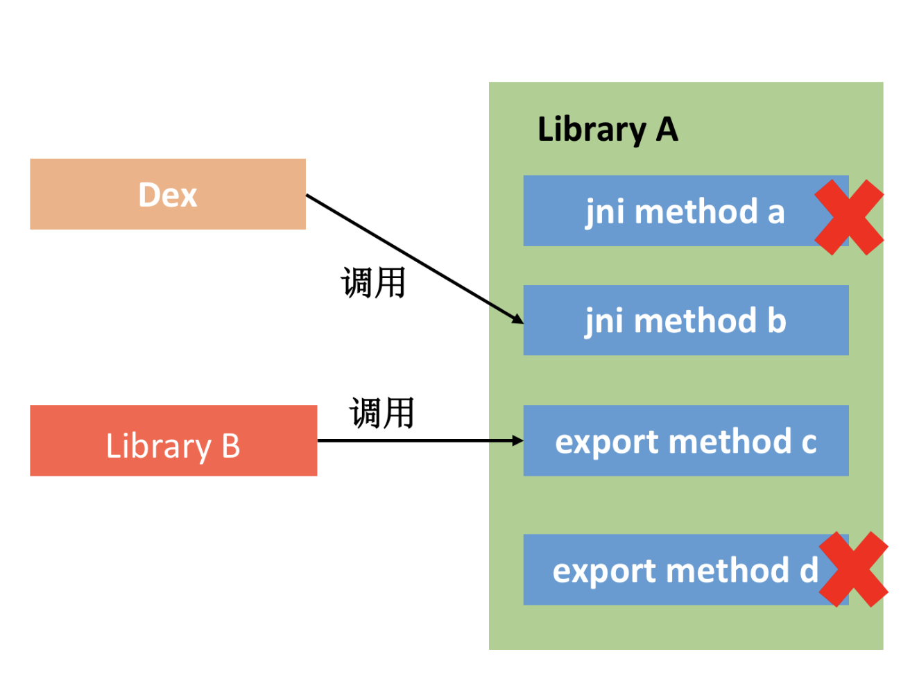
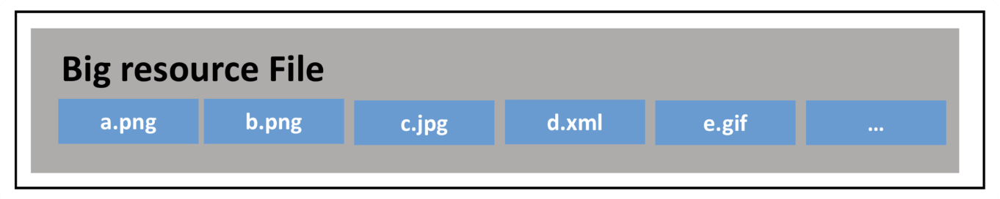
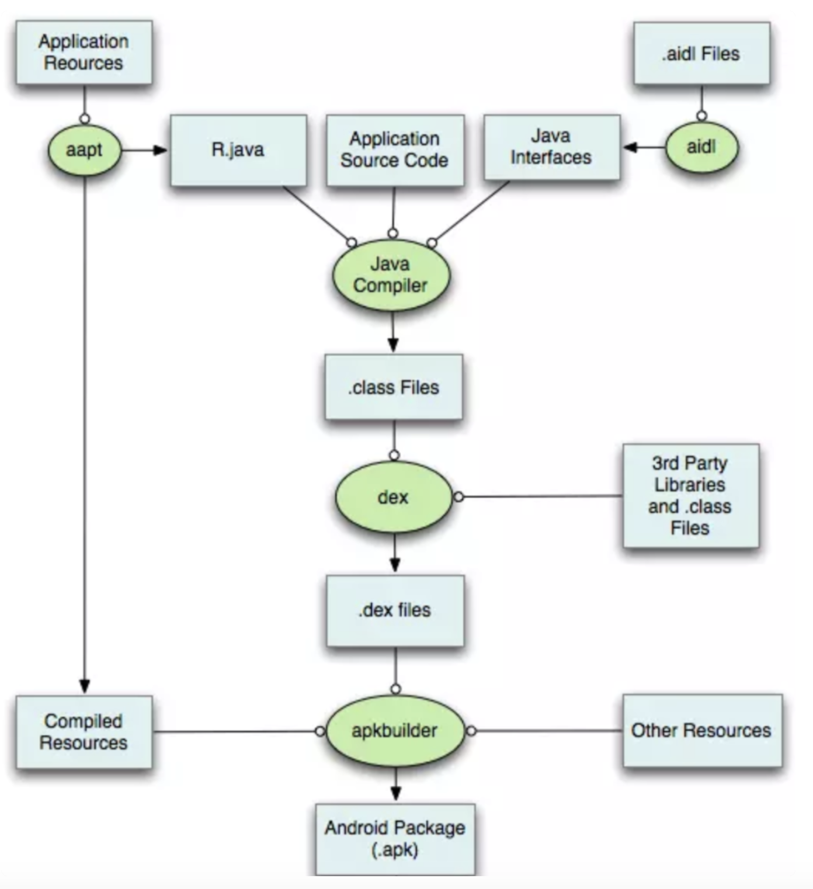
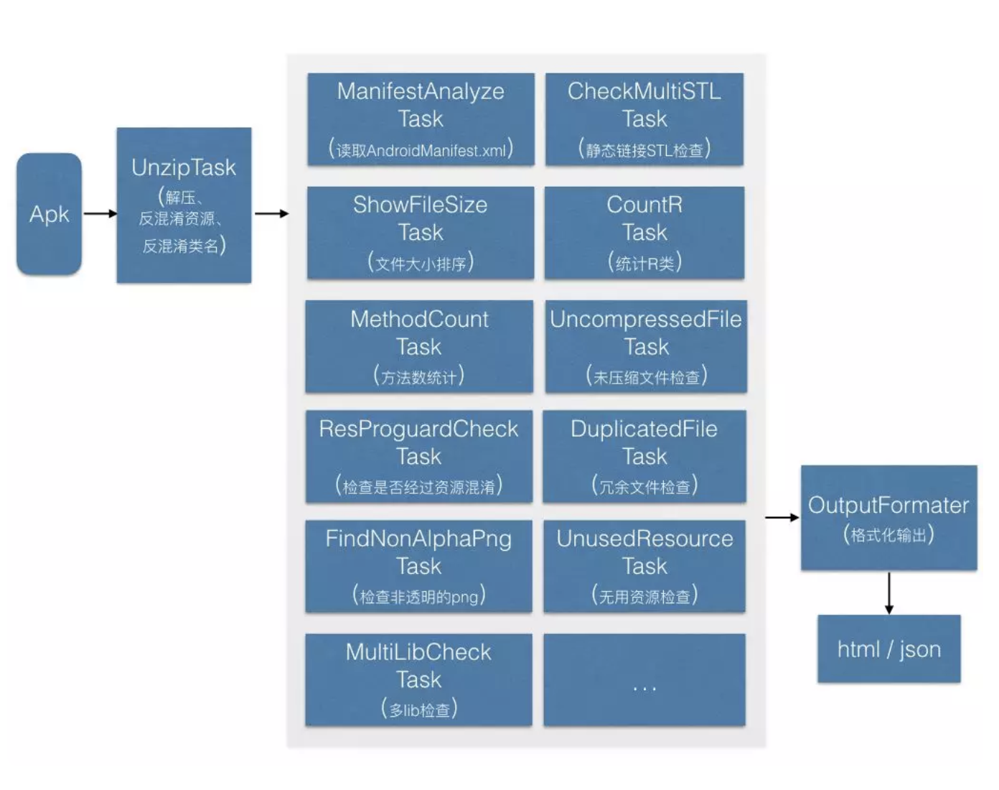

# 包体积优化
## 0x01 安装包的背景知识
### 为什么要优化包体积

* 下载转换率。太大导致用户取消下载
* 推广成本。渠道推广和厂商预装。厂商留给预装应用空间有限
* 应用市场。AppStore 和 Google Play 有限制

### 包体积与应用性能

* 安装时间。**文件拷贝、Library 解压、编译 ODEX、签名校验**等流程
* 运行内存。Resource 资源、Library 以及 Dex 类加载占用不少的内存
* ROM 空间。启动解压之后需要更大的空间，对于低端机压力大。
* 业务梳理。删除无用或者低价值的业务。
* 开发模式升级。采用小程序、H5等

## 0x02 包体积优化

安装包由 Dex、Resources、Assets、Library 以及 metadata 签名信息 五部分组成。

海外统一的 Google Play 市场可以根据用户的 ABI(Application Binary Interface)、density 和 language 发布。

现针对这五部分进行优化



### 一、 Dex 代码
	
从 proguard 和 dex (去除 debug 信息、分包、压缩)  入手。参考 Facebook 的 [ReDex](https://github.com/facebook/redex)
	
#### 1. ProGuard
* 核心优化主要有三个：Shrink、Optimize 和 Obfuscate，也就是裁剪、优化和混淆。
		
* 检查过度 keep，如 `keep *`，输出最终配置进行检查，
`-printconfiguration configuration.txt` 		
* 加大混淆力度，对非 exported 的四大组件以及 View 混淆。1.XML 替换 2.代码替换(ASM)
	
#### 2. 去掉 Debug 信息或者去掉行号

某个应用通过相同的 ProGuard 规则生成一个 Debug 包和 Release 包，其中 Debug 包的大小是4MB，Release 包只有 3.5MB。差异在 DebugItem。
		
debugItem包含两种主要信息：
	
* 调试的信息。函数的参数变量和所有局部变量
	
* 排查问题的信息。所有的指令集行号和源文件行号的对应关系。[《Android 包大小极致压缩》](https://mp.weixin.qq.com/s/_gnT2kjqpfMFs0kqAg4Qig) 修改 dex 文件，把多余的 debugInfoItem 全部删掉了，只留了一个 debugInfoItem
		
	
	
	
	
	
	
#### 3. Dex 分包
	
问题：如果将 ClassA 与 ClassB 分别编译到不同的 Dex 中，由于 methodA 调用了 methodB，所以在 classes2.dex 中也需要加上 methodB 的 id。
	
为了进一步减少 Dex 的数量，我们希望每个 Dex 的方法是满的，即分配了65536个方法。
	
`Dex 信息有效率 = define methods 数量 /reference methods 数量
`	


	
#### 4. Dex 压缩
		
所有的 Dex 都合并成同一个文件，并通过 XZ压缩。

产生的问题：

1. 首次启动解压缩(这里为什么不采用 Zstandard 或者 Brotli 呢？压缩率和解压速度的权衡) 

2. ODEX 文件生成，Dex 非常多的时候会增加安装时间，首次生成 ODEX 会占用很久，(facebook oatmeal方式)	
 		
### 二、 Native Library

传统的方法：去除 Debug 信息、使用 c++_shared。

#### Library 压缩

跟 Dex 压缩一样，LIbrary 优化最有效的方法是使用 XZ 或者7-Zip 压缩。

默认的 lib 目录，**加载** 少数启动相关的 Library，其他的在首次启动时 **解压**。

对于 Library 格式，压缩率同比可以比 Zip 高30%左右，效果惊人。

Facebook 有一个 So 加载开源库 [SoLoader](https://github.com/facebook/SoLoader)，跟这套方案配合使用。

#### Library 合并与裁剪

Facebook 的编译构建工具 [Buck](https://buckbuild.com/)

* Library 合并

	在 Android 4.3 之前，进程加载的 Library 数量是有限制的。在编译过程中，自动将部分 Library 合并成一个。	
* Library 裁剪
	
	Buck 里面有一个 relinker 功能，原理就是分析代码中 JNI 方法以及不同 Library 的方法调用，找到没有无用的导出 symbol，将他们删除。这样 relinker 在编译的时候也会把对应无用的代码同时删除，相当于 Proguard Shrinking 功能
	
	

### 三、 Assets / Resource / metadata 资源

文件/目录	| 描述
--- | ---
classes(n).dex	| classes文件是Java Class，被DEX编译后可供Dalvik/ART虚拟机所理解的文件格式
lib/	| 存放so文件，可能会有armeabi、armeabi-v7a、arm64-v8a、x86、x86_64、mips，大多数情况下只需要支持armabi与x86的架构即可，如果非必需，可以考虑拿掉x86的部分
res/	| 存放编译后的资源文件，例如：drawable、layout等等
assets/	| 应用程序的资源，应用程序可以使用AssetManager来检索该资源
META-INF/	| 该文件夹一般存放于已经签名的APK中，它包含了APK中所有文件的签名摘要等信息
resources.arsc	| 编译后的二进制资源文件
AndroidManifest.xml	| Android的清单文件，格式为AXML，用于描述应用程序的名称、版本、所需权限、注册的四大组件

#### 1. AndResGuard 工具

##### a. 资源混淆

**短路径优化**：把资源和文件的名字混淆成短路径

```
res/drawable/icon -> res/s/a
```

这样处理对以下资源文件有优化作用：

* *resources.arsc*，
	
	该为资源索引文件，记录着资源文件的**名称**与**路径**

* *metadata 签名文件*
	
	[MF 与 SF](https://cloud.tencent.com/developer/article/1354380) 记录所有文件的**路径**以及哈希值

* *ZIP 文件索引*
	ZIP 文件格式里面也需要记录每个文件 Entry 的**路径**，压缩算法。CRC、文件大小等信息

资源文件数量较多，通过短路径的优化，可以减少包体积大小。

例如：消除 Assets 文件夹下文件内容的空格、换行等

##### b. 极限压缩

AndResGuard 极限压缩功能体现在两个方面：

* 更高的压缩率
	
	虽然我们使用的还是 Zip 算法，但利用了 7-Zip 的大字典优化，APK压缩率可以提升 3% 左右
	
* 压缩更多的文件

	Android 编译过程中，下面这些格式的文件指定不压缩；在 AndResGuard 中，我们支持针对 resources.arsc、PNG、JPG 以及 GIF 等文件强制压缩
	
	```
	/* these formats are already compressed, or don't compress well */
static const char* kNoCompressExt[] = {
    	".jpg", ".jpeg", ".png", ".gif",
    	".wav", ".mp2", ".mp3", ".ogg", ".aac",
    	".mpg", ".mpeg", ".mid", ".midi", ".smf", ".jet",
    	".rtttl", ".imy", ".xmf", ".mp4", ".m4a",
    	".m4v", ".3gp", ".3gpp", ".3g2", ".3gpp2",
   		".amr", ".awb", ".wma", ".wmv", ".webm", ".mkv"
	};
	```
	
Q：Android不压缩这些文件的原因？

A：1. 压缩效果不明显；2. 读取时间与内存的考虑，如果文件没有压缩，系统可以利用 mmap 的方式直接读取，而不需要一次性解压并放在内存中

Android 6.0 之后支持不压缩 Library 文件，这样安装 APK 的时候也不需要把 Library 文件解压出来，系统可以直接 mmap 安装包中的 Library 文件。在 AndroidManifest.xml 配置 `android:extractNativeLibs="true"`即可

在 **启动性能**、**内存** 和 **安装包体积** 之间做一个抉择

#### 2. 进阶优化方法

##### a. 资源合并

在资源混淆方案中，我们发现**资源文件的路径**对于 resources.arsc、签名信息以及 ZIP 文件信息都会影响。而且因为**资源文件数量非常非常多，导致这部分体积非常大**。

**考虑把资源文件合并成同一个大文件(自定义的二进制文件)，这样肯定比混淆方案**



大部分的换肤方案也采用这个思路，这个大资源文件就相当于一套皮肤。

但实现需要解决不少问题：

* 资源的解析
	我们需要**模拟系统实现资源文件的解析**，例如把 PNG、JPEG 以及 XML 文件转换为 Bitmap 或者 Drawable，这样获取资源的方法需要改成我们自定义的方法。
	
	```
	// 系统默认的方式
	Drawable drawable = getResource().getDrawable(R.drawable.loading);
	
	// 自定义获取方式
	Drawable drawable = CustomResManager.getDrawable(R.drawable.loading);
	```
	
	Q: 为什么不像 SVG 那样，直接把这些解析完的所有 Drawable 全部丢到系统的缓存中？这样代码就无需做太多修改？
	
	A: 主要考虑对内存的影响，全部资源文件一次性全部解析，并且丢到系统的缓存中，这部分会占用非常大的内存。

* 资源的管理
	
	考虑到内存和启动时间，所有的资源也是**用时加载**，我们只需要使用 mmap 来加载 “Big resource File”。
	
	同时还要实现自己的资源缓存池 ResourceCache，释放不再使用的资源，参考 Glide 图片库的实现。

##### b. 无用资源

AndResGuard 中的资源混淆实现的是 ProGuard 的 Obfuscate，那我们是否可以同样实现资源的 Shrink，也就是裁剪功能呢？应用经过长时间的迭代，总会又一些无用资源。

无用资源优化方案：

 * 第一阶级 Lint
	
	* 工具栏 -> Analyze -> Inspect Code
	
	* 工具栏 -> Analyze -> Run Inspection By Name -> 输入 unused 
	
	* 直接选择 `Remove All Unused Resources`，删除所有无用资源。 
	
	静态代码扫描工具，支持 Unused Resources 扫描。
	
	缺点：没有考虑 ProGuard 的代码裁剪。在 ProGuard 过程中我们会 Shrink 掉大量无用代码，但是 Lint 工具并不能检查出这些无用代码所引用的无用资源。
	
 * 第二阶段 shrinkResources
	
	```
	android {
		buildTypes {
			release {
				shrinkResources true
				minifyEnabled true
			}
		}
	}
	```
	所以 Android 在第二阶段增加了 `shrinkResources`资源压缩功能，配合 ProGuard 的 `minifyEnabled` 功能同时使用。
	
	如果 ProGuard 把部分无用代码移除，这些代码所引用的资源也会标记为无用资源，然后通过资源压缩功能删除。
	
	缺点：

	* **没有处理 resources.arsc 文件**。导致大量无用的 String、ID、Attr、Dimen 等资源并没有删除
	
	* **没有真正删除资源文件**。对于Drawable、Layout 这些无用资源，shrinkResources 没有真正把他们删除，而是仅仅替换为一个空文件。
		
		Q: 为什么不能删除？
		
		A: 因为 resources.arsc 里面还有这些文件的路径。所以尽管我们应用由大量无用资源，但是系统目前并没有真正减少文件数量。这样 resources.arsc、签名信息以及 ZIP 文件信息这几个大头依然没有任何改善。
		
		
		
		* 由于 Java 代码需要用到 R.java文件，所以我们需要把 R.java提前准备好
		* 在编译 Java 代码过程，已经根据 R.java 文件，直接将代码中资源的引用替换为常量，例如 R.string.sample替换为 0x7f010001
		* .ap_ 资源文件的同步编译，例如 resources.arsc、XML 文件的处理等

		在这个过程如果强行删除无用资源文件，resources.arsc 和 R.java 文件的资源 ID 就会改变(默认是连续)，这个时候代码中已经替换过的 0x7f010001 就会出现资源错乱或者找不到的情况。
		
		因此系统为了避免发生这种情况，采用了这种的方法，并没有二次处理 resources.arsc 文件，只是仅仅把无用的 Drawable 和 Layout 文件替换为空文件。
	
 * 第三阶段 realShrinkResources
 	
 	怎样真正删除无用资源的删除功能？ [ResourceUsageAnalyzer](https://android.googlesource.com/platform/tools/base/+/studio-master-dev/build-system/gradle-core/src/main/java/com/android/build/gradle/tasks/ResourceUsageAnalyzer.java) 的注释就提供了一个思路，利用 resources.arsc 中的 Public ID 机制，实现非连续的资源 ID。
 	
 	keep 住保留资源的 ID，保证已经编译完的代码可以正常找到对应的资源，抹去所有无用的资源相关信息，相当于整个文件重写了。异常复杂，所以 Android 还没有提供这套方案的完整实现。

### 四、 包体积监控

超过 100KB 的功能进行审批

#### 大小监控

对比上一版本包体积情况，分析原因，是否有优化空间
	
#### 依赖监控

新增 JAR 以及 AAR 的依赖，防止引入超大开源库

#### 规则监控

将包体积抽象成规则，例如无用资源、大文件、重复文件、R 文件等。[Matrix-ApkChecker](https://mp.weixin.qq.com/s/tP3dtK330oHW8QBUwGUDtA)




另：可学习美团 [Android App包瘦身优化实践](https://tech.meituan.com/2017/04/07/android-shrink-overall-solution.html)

