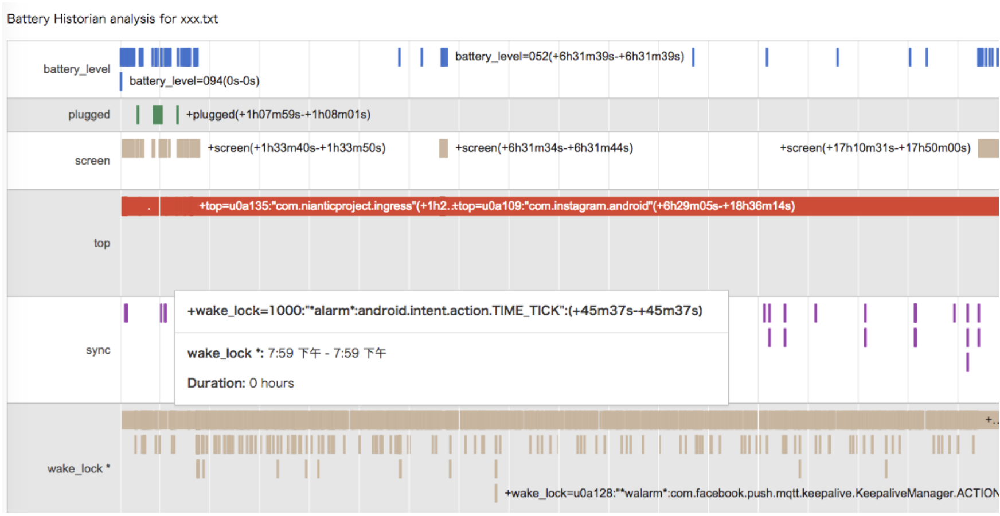
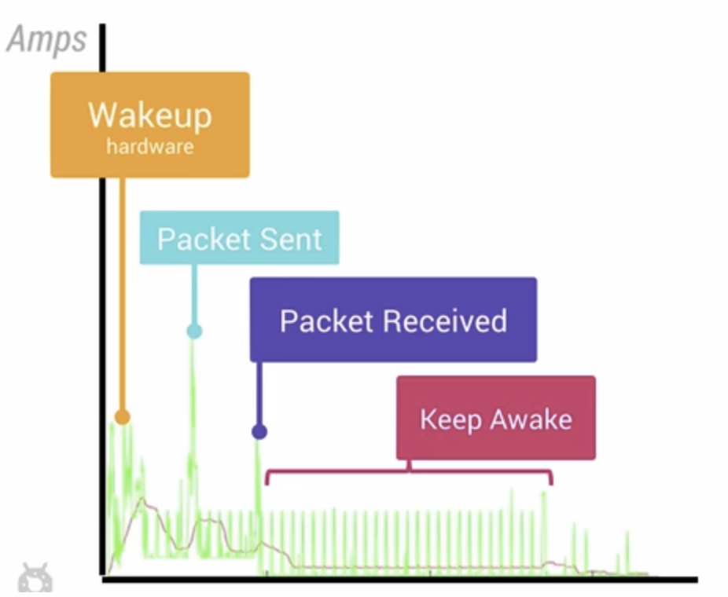

## 电量性能优化

### 电量消耗
* 手机各个硬件模块的耗电量是不一样的，有些模块非常耗电，而有些模块则相对显得耗电量小很多
* 电量消耗的计算与统计是一件麻烦而且矛盾的事情，记录电量消耗本身也是一个费电量的事情。唯一可行的方案是使用第三方监测电量的设备，这样才能够获取到真实的电量消耗
* 当设备处于待机状态时消耗的电量是极少的，以N5为例，打开飞行模式，可以待机接近1个月。可是点亮屏幕，硬件各个模块就需要开始工作，这会需要消耗很多电量
* 使用WakeLock或者JobScheduler唤醒设备处理定时的任务之后，一定要及时让设备回到初始状态。每次唤醒蜂窝信号进行数据传递，都会消耗很多电量，它比WiFi等操作更加的耗电

### Battery Historian
[Battery Historian](https://developer.android.com/about/versions/android-5.0.html#Power) 是 Android 5.0开始引入的新 API。通过下面指令可以得到设备上电量消耗信息

```
adb shell dumpsys batterystats > xxx.txt  //得到整个设备的电量消耗信息
adb shell dumpsys batterystats > com.package.name > xxx.txt //得到指定app相关的电量消耗信息
```
得到了原始的电量消耗数据之后，我们需要通过Google编写的一个python脚本把数据信息转换成可读性更好的html文件：

```
python historian.py xxx.txt > xxx.html
```



### 电量状态
通过获取手机充电状态，得到充电状态信息之后，针对性对部分代码做优化。比如只有当手机处于 AC 充电状态时才去执行一些耗电操作。

不需要监听广播，直接获取

```
private boolean checkForPower() {
    IntentFilter filter = new IntentFilter(Intent.ACTION_BATTERY_CHANGED);
    Intent batteryStatus = this.registerReceiver(null, filter);
    
    int chargePlug = batteryStatus.getIntExtra(BatteryManager.EXTRA_PLUGGED, -1);
    boolean usbCharge = (chargePlug == BatteryManager.BATTERY_PLUGGED_USB);
    boolean acCharge = (chargePlug == BatteryManager.BATTERY_PLUGGED_AC);
    boolean wirelessCharge = false;
    if (Build.VERSION.SDK_INT >= Build.VERSION_CODES.JELLY_BEAN_MR1) {
        wirelessCharge = (chargePlug == BatteryManager.BATTERY_PLUGGED_WIRELESS);
    }
    return (usbCharge || acCharge || wirelessCharge);
}
```

### Wakelock
使用 WakeLock 唤醒保持 CPU 工作并防止屏幕变暗关闭。但及时释放 WakeLock 是非常重要的。

不恰当的使用 WakeLock 会导致严重的错误。例如网络请求的数据返回时间不确定，导致本来只需要10s的事情一直等待了1个小时，这样会使得电量白白浪费了。这也是为何使用带超时参数的wakelock.acquice()方法是很关键的。

但是仅仅设置超时是并不足够解决问题的，例如设置多长的超时比较合适？什么时候进行重试等等？解决上面的问题，正确的方式可能是使用非精准定时器。使用 JobScheduler 可以帮我们解决这些问题。

### Job Scheduler

执行延迟任务有三种方式：

* AlarmManager
	
	使用AlarmManager设置定时任务，可以选择精确的间隔时间，也可以选择非精确时间作为参数。除非程序有很强烈的需要使用精确的定时唤醒，否者一定要避免使用他，我们应该尽量使用非精确的方式。

* SyncAdapter
	
	我们可以使用SyncAdapter为应用添加设置账户，这样在手机设置的账户列表里面可以找到我们的应用。这种方式功能更多，但是实现起来比较复杂。我们可以从这里看到官方的培训课程：http://developer.android.com/training/sync-adapters/index.html

* JobSchedulor
	
	这是最简单高效的方法，我们可以设置任务延迟的间隔，执行条件，还可以增加重试机制

[Job Scheduler](https://developer.android.com/reference/android/app/job/JobScheduler.html)，不紧急的任务交给 Job Scheduler 集中处理收到的任务，选择合适的时间，合适的网络，再一起进行执行。

示例使用 Job Scheduler 的一段简要示例：

先创建一个 JobService

```
public class MyJobService extends JobService {
    private static final String LOG_TAG = "MyJobService";

    @Override
    public void onCreate() {
        super.onCreate();
        Log.i(LOG_TAG, "MyJobService created");
    }

    @Override
    public void onDestroy() {
        super.onDestroy();
        Log.i(LOG_TAG, "MyJobService destroyed");
    }

    @Override
    public boolean onStartJob(JobParameters params) {
        if (isNetworkConnected()) {
            new SimpleDownloadTask() .execute(params);
            return true;
        } else {
            Log.i(LOG_TAG, "No connection on job " + params.getJobId() + "; sad face");
        }
        return false;
    }

    @Override
    public boolean onStopJob(JobParameters params) {
        Log.i(LOG_TAG, "Whelp, something changed, so I'm calling it on job " + params.getJobId());
        return false;
    }

    private boolean isNetworkConnected() {
        ConnectivityManager connectivityManager =
                (ConnectivityManager) getSystemService(Context.CONNECTIVITY_SERVICE);
        NetworkInfo networkInfo = connectivityManager.getActiveNetworkInfo();
        return (networkInfo != null && networkInfo.isConnected());
    }

    private class SimpleDownloadTask extends AsyncTask<JobParameters, Void, String> {

        protected JobParameters mJobParam;

        @Override
        protected String doInBackground(JobParameters... params) {
            // cache system provided job requirements
            mJobParam = params[0];
            try {
                InputStream is = null;
                // Only display the first 50 characters of the retrieved web page content.
                int len = 50;

                URL url = new URL("https://www.google.com");
                HttpURLConnection conn = (HttpURLConnection) url.openConnection();
                conn.setReadTimeout(10000); //10sec
                conn.setConnectTimeout(15000); //15sec
                conn.setRequestMethod("GET");
                //Starts the query
                conn.connect();
                int response = conn.getResponseCode();
                Log.d(LOG_TAG, "The response is: " + response);
                is = conn.getInputStream();

                // Convert the input stream to a string
                Reader reader = null;
                reader = new InputStreamReader(is, "UTF-8");
                char[] buffer = new char[len];
                reader.read(buffer);
                return new String(buffer);

            } catch (IOException e) {
                return "Unable to retrieve web page.";
            }
        }

        @Override
        protected void onPostExecute(String result) {
            jobFinished(mJobParam, false);
            Log.i(LOG_TAG, result);
        }
    }
}

```

然后通过模拟点击 Button 触发 N 个任务，交给 JobService 处理

```
public class FreeTheWakelockActivity extends ActionBarActivity {
    public static final String LOG_TAG = "FreeTheWakelockActivity";

    TextView mWakeLockMsg;
    ComponentName mServiceComponent;

    @Override
    protected void onCreate(Bundle savedInstanceState) {
        super.onCreate(savedInstanceState);
        setContentView(R.layout.activity_wakelock);

        mWakeLockMsg = (TextView) findViewById(R.id.wakelock_txt);
        mServiceComponent = new ComponentName(this, MyJobService.class);
        Intent startServiceIntent = new Intent(this, MyJobService.class);
        startService(startServiceIntent);

        Button theButtonThatWakelocks = (Button) findViewById(R.id.wakelock_poll);
        theButtonThatWakelocks.setText(R.string.poll_server_button);

        theButtonThatWakelocks.setOnClickListener(new View.OnClickListener() {
            @Override
            public void onClick(View v) {
                    pollServer();
            }
        });
    }

    public void pollServer() {
        JobScheduler scheduler = (JobScheduler) getSystemService(Context.JOB_SCHEDULER_SERVICE);
        for (int i=0; i<10; i++) {
            JobInfo jobInfo = new JobInfo.Builder(i, mServiceComponent)
                    .setMinimumLatency(5000) // 5 seconds
                    .setOverrideDeadline(60000) // 60 seconds (for brevity in the sample)
                    .setRequiredNetworkType(JobInfo.NETWORK_TYPE_ANY) // WiFi or data connections
                    .build();

            mWakeLockMsg.append("Scheduling job " + i + "!\n");
            scheduler.schedule(jobInfo);
        }
    }
}
```

### 网络消耗电量

* 如下图所示，电量在**激活瞬间**，**发送数据的瞬间**，**接收数据的瞬间** 有明显的消耗。在网络硬件模块被激活之后，会继续保持几十秒的电量消耗，知道没有新的网络操作行为之后，才会进入休眠状态

	

* 移动网络传输数据，电量消耗有[三种状态](http://hukai.me/android-training-course-in-chinese/connectivity/efficient-downloads/efficient-network-access.html)，Full power / Low power / Standby
* 在蜂窝移动网络下，最好做到批量执行网络请求，尽量避免频繁的间隔网络请求。
* WiFi 情况下，网络传输的电量消耗比移动网络少很多，应该尽量减少移动网络下的数据传输。

### 定位消耗电量

开启定位功能是一个相对比较耗电的操作。通过 GPS 定位服务相比起使用网络进行定位更加耗电，但是也相对精准一些。

谷歌自带的定位服务国内受限，不过优化策略可以参考

`implementation 'com.google.android.gms:play-services:12.0.1'`

```
LocationRequest  mLocationRequest = new LocationRequest();
mLocationRequest.setPriority(LocationRequest.PRIORITY_HIGH_ACCURACY);
mLocationRequest.setInterval(10000);
mLocationRequest.setFastestInterval(5000);
```

* setInterval
	* 每隔多长的时间获取一次位置更新，时间相隔越短，自然花费的电量就越多，但是时间相隔太长，又无法及时获取到更新的位置信息。
	* 其中存在的一个优化点是，我们可以通过判断返回的位置信息是否相同，从而决定设置下次的更新间隔是否增加一倍，通过这种方式可以减少电量的消耗 

* setFastestInterval
	* 整个系统中很可能存在其他的应用也在请求位置更新，那些应用很有可能设置的更新间隔时间很短，这种情况下，我们就可以通过setFestestInterval的方法来过滤那些过于频繁的更新。

* setPriority()
	* 提供了四种不同精度与耗电量的参数给应用进行设置调用，`PRIORITY_HIGH_ACCURACY / PRIORITY_BALANCED_POWER_ACCURACY / PRIORITY_LOW_POWER / PRIORITY_NO_POWER `

