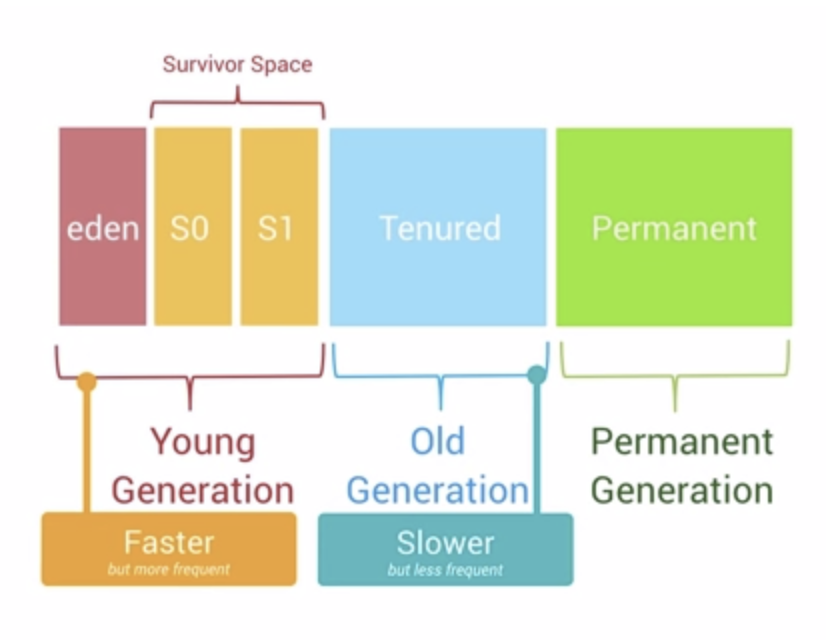
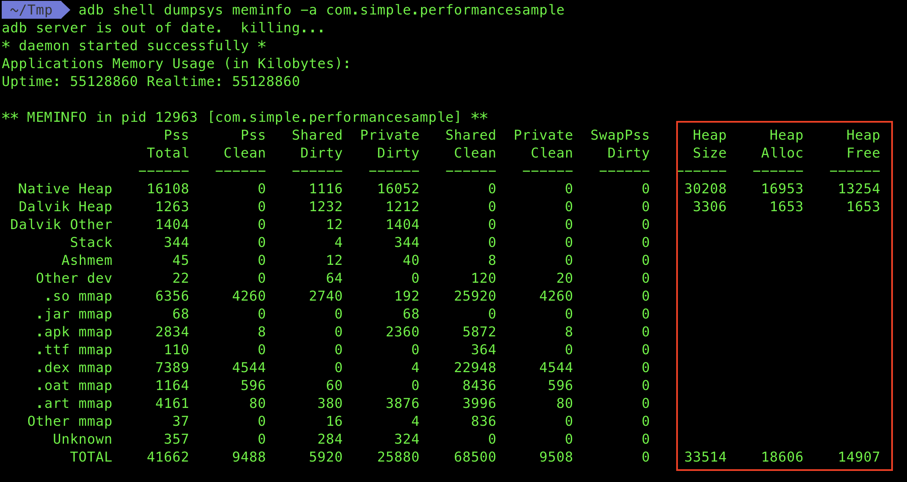
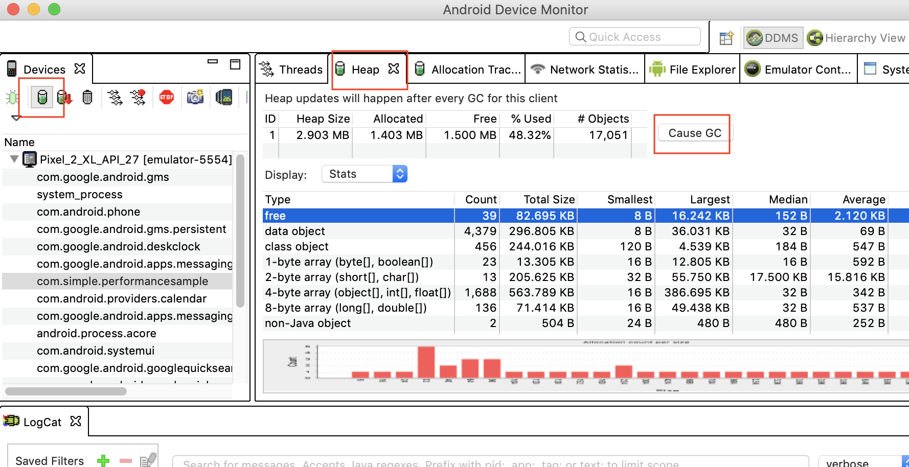
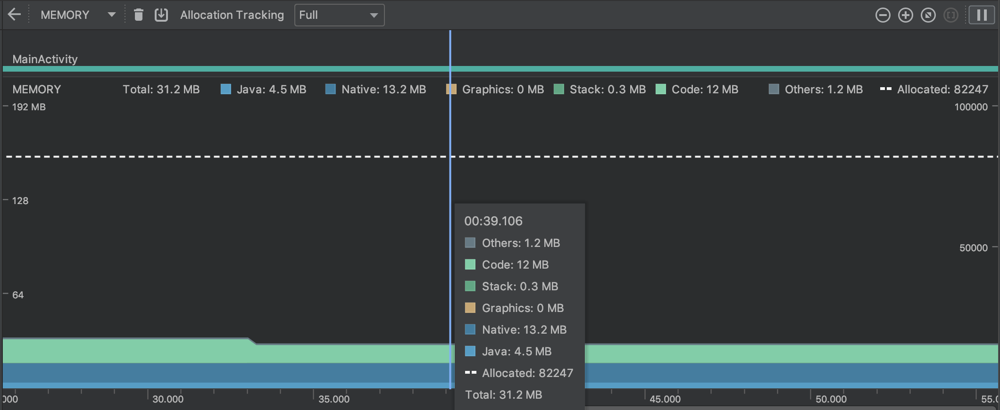
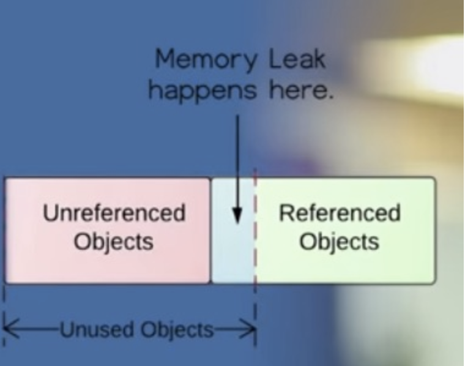
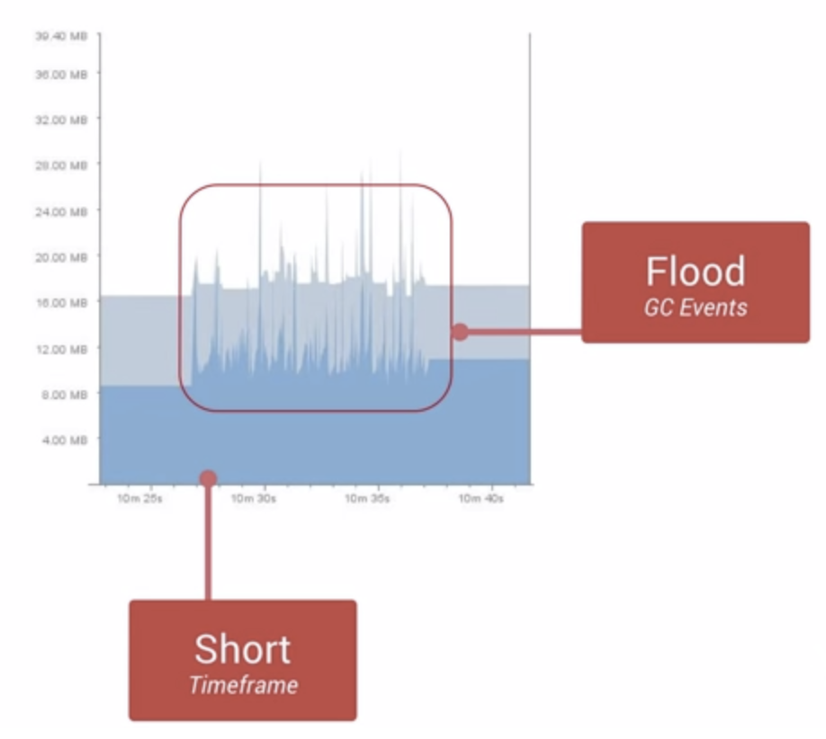

# 内存性能优化

https://www.udacity.com/course/android-performance--ud825

## 0x01 Android是如何管理内存的
RAM - Random Access Memory 随机存取存储器，是与 CPU 直接交换数据的内存存储器，在物理内存优先的移动操作系统上尤为宝贵。

[Swap Space](https://segmentfault.com/a/1190000008125116)：是磁盘上的一块区域，可以是一个分区，也可以是一个文件，或者是他们的组合。简单点说，当系统物理内存吃紧时，Linux会将内存中不常访问的数据保存到swap上，这样系统就有更多的物理内存为各个进程服务，而当系统需要访问swap上存储的内容时，再将swap上的数据加载到内存中，这就是我们常说的swap out和swap in。

**Paging**

**memory-mapping(mmaping)**

Android并没有为内存提供交换区 Swap Space，但是它使用 paging 与 memory-mapping(mmaping)的机制来管理内存。

这意味着任何你修改的内存(无论是通过分配新的对象还是去访问mmaped pages中的内容)都会储存在 RAM 中，而且不能被 paged out。

因此唯一完成释放内存的方法是释放哪些你可能 hold 住对象的引用，当这个对象没有被任何其他对象所引用的时候，它能够被 GC 回收。只有一种例外是：如果系统想要在其他地方重用这个对象。

### Generational Heap Memory 模型

Java 有 GC 回收机制。Android 系统里面有一个Generational Heap Memory的模型，**系统会根据内存中不同的内存数据类型分别执行不同的GC操作**。
最近刚分配的对象会放在Young Generation区域，这个区域的对象通常都是会快速被创建并且很快被销毁回收的，同时这个区域的GC操作速度也是比Old Generation区域的GC操作速度更快的。

除了速度差异之外，执行GC操作的时候，**所有线程的任何操作都会需要暂停**，等待GC操作完成之后，其他操作才能够继续运行。

> 单个的GC并不会占用太多时间，但是**大量不停的GC操作则会显著占用帧间隔时间(16ms)**。

### 共享内存
* 每一个 app 的进程都是从一个被叫做 Zygote 的进程中 fork 出来的。这使得大多数的 RAM pages 被用来分配给 framework 的代码，同时使得 RAM 资源能够在应用的所有进程中进行共享
* 大多数 static 的数据被 mmapped 到一个进程中。这不仅能够使同样的数据能够在进程间进行共享，而且能早需要的时候别 paged out。例如以下既照顾你 static 数据：
    * Dalvik 代码，放在一个预链接好的 .odex 文件中以便直接 mapping
    * App resources，通过把资源表结构设计成便于 mmapping 的数据结构，另外还可以通过把 APK 中文件做 aligning 的操作优化
    * 传统项目元素，比如 .so 文件中的本地代码
* 在很多情况下，Android 通过显示的分配共享内存区域来实现一些动态 RAM 区域能够在不同进程间进行共享。

### 分配和回收内存
* 每一个进程的 Dalvik heap 都有一个受限的虚拟内存范围。
* 逻辑上讲的 heap size 和实际物理上使用的内存数量是不等，Android 会计算一个叫做 Proportional Set Size(PSS)的值，它记录了哪些和其他进程进行共享的内存大小
* Dalvik heap 与逻辑上的 heap size 不吻合，这意味着 Android 并不会去做 heap 中碎片整理用来关闭空闲区域。Android 仅仅会在 heap 的尾端出现不使用的空间时才会做收缩逻辑 heap size 的动作。但是这并不意味着被 heap 所使用的物理内存大小不能被收缩，在垃圾回收之后，Dalvik 会遍历 heap 并找出不使用的 pages，然后使用 madvise(系统调用) 把哪些 pages 返回给kernal。因此，成对的 allocations 与 deallacations 大块的数据可以使得物理内存能够被正常回收。然而，回收碎片化的内存则会使得效率低下很多，因为哪些碎片化的分配页面也许会被其他地方所共享到。

### 限制应用的内存
* 为了维持多任务的功能环境，Android 为每一个 app 都设置了一个硬性的 heap size 限制

### 切换应用
* Android 并不会在用户切换不同应用的时候做交换内存的操作。Android 会把那些不包含 foreground 组件的进程放到 LRU cache 中。从而实现应用的快速切换。
* 当系统进入到低内存状态时，会由系统根据 LRU 的规则与其他因素考虑决定杀掉哪些进程。

## 0x02 管理自己的应用内存
### 查看内存的使用情况
1. 命令行 `adb shell dumpsys meminfo -a <package-name>`

2. Heap Viewer,查看当前内存快照

3. Profile https://developer.android.com/studio/profile

### OOM 发生的条件
关于 Native Heap，Dalvik Heap，Pss 等内存管理机制比较复杂，简单的说，通过不同的内存分配方式(malloc/mmap/JNIEnv/etc)对不同的对象(bitmap/etc)进行操作会因为 Android 系统版本的差异而产生不同的行为，对 Native Heap 与 Dalvik Heap 以及 OOM 的判断条件都会有所影响。

* 在 2.x 系统上 GC LOG中的 `dalvik allocated + external allocated + 新分配的内存大小 >= getMemoryClass()` 就会发生 OOM。
* 在 4.x 系统上废除了 external 的计数器，类似 bitmap 的分配改到 dalvik 的 java heap 中申请，只要 `allocated + 新分配的内存大小 >= getMemoryClass()` 就会发生 OOM。

### 如何避免 OOM
从减小对象的内存占用、内存对象的重复利用、避免对象的内存泄漏、内存使用策略优化等四个方面着手。

#### 减少对象的内存占用

避免 OOM 的第一步就是要尽量减少新分配出来的对象占用内存的大小，尽量使用更加轻量的对象。

1. 使用更加轻量的数据结构
    * 使用 ArrayMap/SparseArray而不是 HashMap 等传统数据结构
    * HashMap 需要额外的实例对象记录 Mapping 操作
    * SparseArray 等更高效在于避免装箱和解箱
2. 避免在 Android 里面使用 Enum
    * enums 是 static constants 大约两倍
3. 减少 Bitmap 对象的内存占用
    * Bitmap 是极容易消耗内存的大户，减小创建出来的 Bitmap 的内存占用是很重要的。以下俩种方式：
        * inSample：缩放比例；图片载入内存之前，计算合适的缩放比例，避免不必要的大图载入
        * decode formate：解码格式；选择ARGB_8888/RBG_565/ARGB_4444/ALPHA_8存在极大差异
4. 使用更小的图片
    * 设计给出资源图片，注意留意是否存在压缩的空间，使用更小的图片。不仅可以减少内存的使用，还可以避免因内存不足而发生的 InflationException。
    
#### 内存对象的重复利用

大多数对象的复用，最终实施的方案都是利用对象池技术，要么在编写代码的时候显示的创建对象池，然后处理好复用的实现逻辑；要么就是利用系统框架既有的某些复用特性达到减少对象的重复创建，从而减少内存的分配与回收。

1. 复用系统自身的资源
    * Android 系统本身内置了很多资源，可以直接引用，但要注意版本差异性
2. 注意在 ListView/GridView 等出现大量重复子组件的视图里面对 ConvertView 的复用
3. Bitmap 对象的复用
    * 在 ListView 与 GridView 等显示大量图片的空间里面使用 LRU 机制缓存处理好的 Bitmap
    * 利用 inBitmap 的高级特性提高系统在 Bitmap 分配与释放执行效率上的提升。使用 inBitmap 属性告知 Bitmap 解码器去尝试使用已经存在的内存区域。限制：1.新申请的 bitmap 必须小于或等于赋值过的 bitmap 大小。2.解码格式相同
4. 避免在 onDraw() 方法里面执行对象的创建
    * 类似 onDraw() 等频繁调用的方法，避免在这里创建对象的操作。因为它会迅速增加内存，容易引起频繁的 GC，甚至内存抖动。
5. StringBuilder
    * 大量字符串拼接的操作，考虑使用 StringBuilder 来替代频繁的“+”   
    
#### 避免对象的内存泄漏
内存对象的泄漏，会导致一些不再使用的对象无法及时释放，这样一方面占用了宝贵的内存空间，很容易导致后续需要分配内存的时候，空间不足而出现 OOM；另一方面使得每级 Generation 的内存区域可用空间变小，GC 就会更容易被处罚，容易出现内存抖动，从而引发性能问题

工具检查：
LeakCanary：[github](https://github.com/square/leakcanary)，[中文使用说明](http://www.liaohuqiu.net/cn/posts/leak-canary-read-me/)
MAT：[英文参考](http://android-developers.blogspot.pt/2011/03/memory-analysis-for-android.html)，[中文参考](http://androidperformance.com/2015/04/11/AndroidMemory-Usage-Of-MAT/)

1. 注意 Activity 的泄漏
    * 内部类引用导致 Activity 的泄漏
        * 最典型的场景是 Handler 导致的 Activity 泄漏，如果 Handler 中有延迟的任务或者是等待执行的任务队列过长，都有可能因为 Handler 继续执行而导致 Activity 发生泄漏。此时的引用关系链 `Looper -> MessageQueue -> Message -> Handler -> Activity`。为了解决这个问题，可以在 UI 退出之前，执行 remove Handler 消息队列中的消息与 Runnable 对象。或者是使用 Static + WeakReference 的方式来达到断开 Handler 与 Activity 之间存在引用关系的目的。
    * Activity Context 被传递到其他实例中，可能导致自身被引用而发生泄漏
        * 内部类引起的泄漏不仅仅会发生在 Activity 上，其他任何内部类出现的地方，都需要特别注意。我们可以考虑尽量使用 Static 类型的内部类，同时使用 WeakReference 的机制来避免因为相互引用而出现的泄漏。
        
2. 考虑使用 Application Context而不是 Activity Context
3. 注意 Bitmap 对象的及时回收
    * 虽然大多数情况下，我们会对 Bitmap 增加缓存机制，但是在某些时候，部分 Bitmap 是需要及时回收的。例如临时创建的某个相对较大的 bitmap 对象，在经过变换得到新的 bitmap 之后，应该尽快回收原始的 bitmap
    * 特别注意 Bitmap#createBitmap()方法，这个函数返回的 bitmap 有可能和原 bitmap 是同一个，在回收的时候，需要特别检查原始 bitmap 和新 bitmap 引用是否相同，只有在不等的情况下，才能够执行原始 bitmap 的 recycle 方法
4. 注意监听器的注销
5. 注意缓存容器中的对象泄漏
    * 有时候，我们为了提高对象的复用性把某些对象放到缓存容器中，可是如果没有及时从容器中清楚，也是有坑你导致内存泄漏的。例如，针对2.3的系统，如果把 drawable 添加到缓存容器，因为 drawable 与 View 的强引用，很容易导致 Activity 发生泄漏。而从4.0开始，就不存在这个问题。解决这个问题，需要对2.3系统上的缓存 drawable 做特殊封装，处理引用解绑的问题，避免泄漏的情况
6. 注意 WebView 的泄漏
    * 示例：https://www.jianshu.com/p/aa5a99b565e7
7. 注意 Cursor 对象是否及时关闭

#### 内存使用策略优化

1. 谨慎使用 large heap
    * getMemoryClass() 获取可用实际 heap 大小
    * manifest 添加 `largeHeap=true` 属性声明更大 heap 空间，使用 getLargeMemoryClass() 获取更大 heap size，但实际情况不一定，还是通过 getMemoryClass()获取实际大小

2. 综合考虑设备内存阈值与其他因素设计合适的缓存大小
    * 例如，在设计 ListView 或者 GridView 的 Bitmap LRU 缓存的时候，需要考虑的点有：
        * 应用程序剩下了多少可用的内存空间
        * 有多少图片会被一次呈现到屏幕上？有多少图片需要事先缓存好以便快速滑动时能够立即显示到屏幕
        * 设备的屏幕大小与密度是多少，一个 xhdpi 的设备会比 hdpi 需要一个更大的 Cache 来 hold 住同样数量的图片
        * 不同页面针对 Bitmap 的设计的尺寸与配置是什么，大概会花费多少内存
        * 页面图片被访问的频率，是否存在其中一部分比其他的图片更具有更高的访问频率，如果是，也许你想要保存那些最长访问的到内存中，或者为不同组别的位图(按访问频率分组)设置多个 LruCache 容器
  
3. 当内存紧张时释放部分内存
    
    Android用户可以随意在不同的应用之间进行快速切换。为了让background的应用能够迅速的切换到forground，每一个background的应用都会占用一定的内存。Android系统会根据当前的系统的内存使用情况，决定回收部分background的应用内存。如果background的应用从暂停状态直接被恢复到forground，能够获得较快的恢复体验，如果background应用是从Kill的状态进行恢复，相比之下就显得稍微有点慢
    
    * onLowMemory()，当所有的background应用都被kill掉的时候，forground应用会收到onLowMemory()的回调。在这种情况下，需要尽快释放当前应用的非必须的内存资源，从而确保系统能够继续稳定运行
    * onTrimMemory() 回调方法参数判断内存情况，TRIM_MEMORY_RUNNING_MODERATE，TRIM_MEMORY_RUNNING_LOW，TRIM_MEMORY_RUNNING_CRITICAL，TRIM_MEMORY_BACKGROUND，TRIM_MEMORY_MODERATE，TRIM_MEMORY_COMPLETE，按照该顺序越来越容易被回收  
    
4. 资源文件需要选择合适的文件夹进行存放
    * 我们知道hdpi/xhdpi/xxhdpi等等不同dpi的文件夹下的图片在不同的设备上会经过scale的处理。例如我们只在hdpi的目录下放置了一张100100的图片，那么根据换算关系，xxhdpi的手机去引用那张图片就会被拉伸到200200。需要注意到在这种情况下，内存占用是会显著提高的。对于不希望被拉伸的图片，需要放到assets或者nodpi的目录下。
 
5. Try catch某些大内存分配的操作
    * 在某些情况下，我们需要事先评估那些可能发生OOM的代码，对于这些可能发生OOM的代码，加入catch机制，可以考虑在catch里面尝试一次降级的内存分配操作。例如decode bitmap的时候，catch到OOM，可以尝试把采样比例再增加一倍之后，再次尝试decode。

6. 谨慎使用 static 对象
    * static 生命周期，和应用的进程保持一致，使用不当很可能导致内存泄漏

7. 注意单例对象中不合理的持有
    * 单例的生命周期，和应用的进程保持一致，使用不当很可能导致内存泄漏
   
8. 珍惜 Services 资源
    * 默认处于停止状态，只有当执行任务时再触发
    * 注意停止 Service 失败而引起的内存泄漏
    * 系统会倾向为了保留 Service 而一直保留该进程
    * 使用 IntentService，它会在处理完任务后尽快结束自己

9. 优化布局层次，减少内存消耗
    * 越扁平化的视图布局，占用的内存就越少，效率越高。
    * 当 UI 隐藏时，释放内存
        * 所有 UI 组件被隐藏接收到 onTrimMemory() 的回调并带有参数 TRIM_MEMORY_UI_HIDDEN，此时释放资源如网络连接等。
        * 区别 onStop()，保证切换回来 UI 能立刻显示

10. 谨慎使用代码抽象
    * 抽象是好的编程实践，能提高代码的灵活性和可维护性
    * 但是，抽象会导致一个显著的开销，需要同等量的代码用于执行，会被 map 到内存中，因此没有显著提升效率，应尽量避免使用 

11. 为序列化的数据使用 nano protobufs
    
12. 避免 bitmaps 的浪费
    * 当加载一个 bitmap 时，仅仅需要保留适配当前屏幕设备分辨率的数据即可，如果原图高于你的设备分辨率，需要做缩小动作。请记住，增加 bitmap 的尺寸会对内存呈现出2次方的增加，因为 X 和 Y 都在增加
    * Android 2.3及其以下，bitmap 对象的 pixel data 存放在native 内存中。3.0开始存放在 Dalvik heap 中。5.0开始一种新的模式
    * 常见的 png，jpeg，webp 等格式图片在设置到 UI 之前需要经过解码，不同的解码率对内存占用有很大的差别；Android 的 Heap 空间不会自动做兼容压缩，当一个大图片需要显示前，很可能找不到那么大的连续空间，会触发 GC 腾出空闲区域，如果无法腾出，则会发生 OOM。
    * 常用的图片格式 ARGB_8888(32)，RGB_565(16)，ARGB_4444(16)，ALPHA_8(8)
    * 缩放图片。Bitmap#createScaleBitmap()，可以快速得到一张经过缩放的图片，可是前提是，原图片需要事先加载到内存中；BitmapFactory#Options#inSampleSize，等比缩放图片，同时避免需要先把图片加载进内存的缺点；BitmapFactory#Options#inJustDecodeBounds 使用这个属性尝试解码图片，可以事先获取图片大小而不至于占用内存
    * 重用 bitmaps。
        * bitmap 占用大量的内存空间，使用对象池技术解决对象频繁创建再回收的效率问题，使用这种方法，每次创建 bitmap 都需要单独占用一块内存区域
        * 为了解决上面问题，可以使用 inBitmap 属性告知 Bitmap 解码器去尝试使用已经存在的内存区域。限制：1.新申请的 bitmap 必须小于或等于赋值过的 bitmap 大小。2.解码格式相同

13. 注意内存开销
    * Enums 内存消耗通常是 static constants 的 2 倍
    * 每一个类都会使用大概 500 bytes
    * 每一个类的实例花销 12-16 bytes
    * 往 HashMap 添加一个 entry 需要额外占用一个 32bytes 的 entry 对象

14. 避免使用依赖注入框架

15. 谨慎使用第三方 library

16. 优化整体性能

17. 使用 ProGuard 剔除不需要的代码

18. 对最终的 APK使用 zipalign

19. 分析你的 RAM 使用情况

20. 使用多进程
    * 把你的 app 组件切分为多个组件，运行在不同的进程。
    * 这个技术需要谨慎使用，大多数 app 都不应该运行在多个进程中，如果使用不当会显著增加内存，当你的 app 需要在后台运行与前台一样的大量任务可以考虑，例如 MusicPlayer

## 0x03 常见内存问题说明
### 内存泄漏 Memory Leaks

内存泄漏：不再用到的对象因为错误引用而无法进行回收

产生问题：导致剩余可用的 Heap Size越来越小，导致频繁触发 GC，更进一步引起性能问题

#### 内存抖动 Memory Churn

内存抖动：短时间内大量的对象被创建又马上被释放。

瞬间产生大量的对象会严重占用 Young Generation 的内存区域，当达到阈值，剩余空间不够的时候，会触发 GC 从而导致刚产生对象又很快被回收。

即使每次分配的对象占用了很少的内存，但他们叠加在一起会增加 Heap 的压力，从而触发更多其他类型的 GC。这个操作很有可能会影响帧率，并使得用户感知到性能问题

通过 Profile 跟踪观察可以发现内存抖动。

##### 解决问题示例
* 避免在 for 循环里面分配对象占用内存，放到循环体之外
* 自定义 View 的 onDraw() 方法每次绘制以及动画执行都会被调用，避免在该方法中执行复杂操作，避免创建对象。使用对象池模型，使用结束手动释放对象池中的对象

