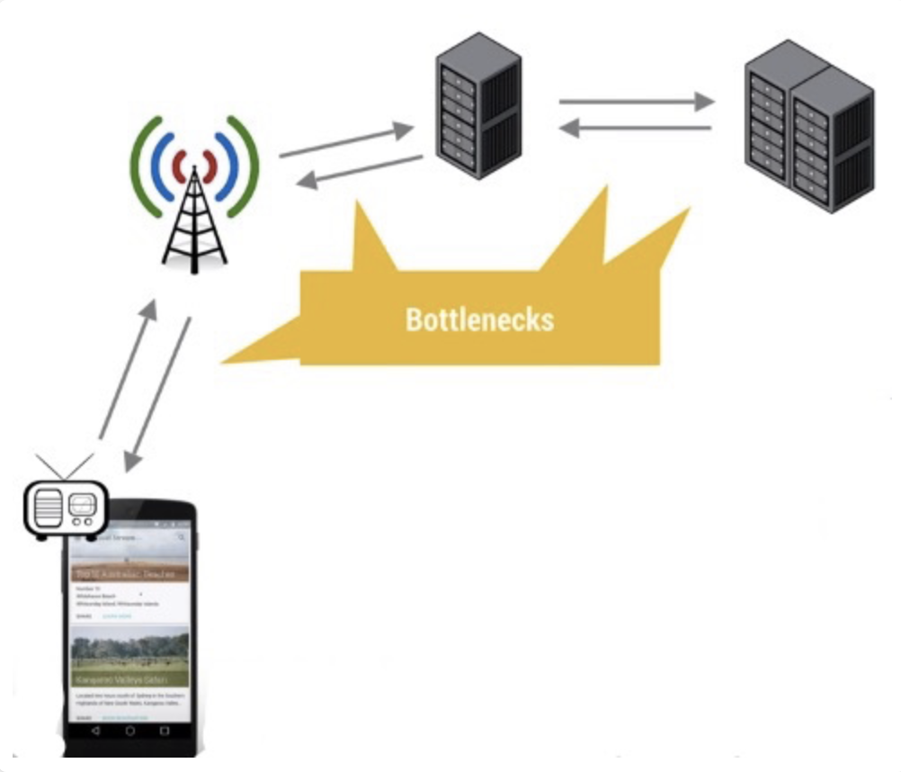
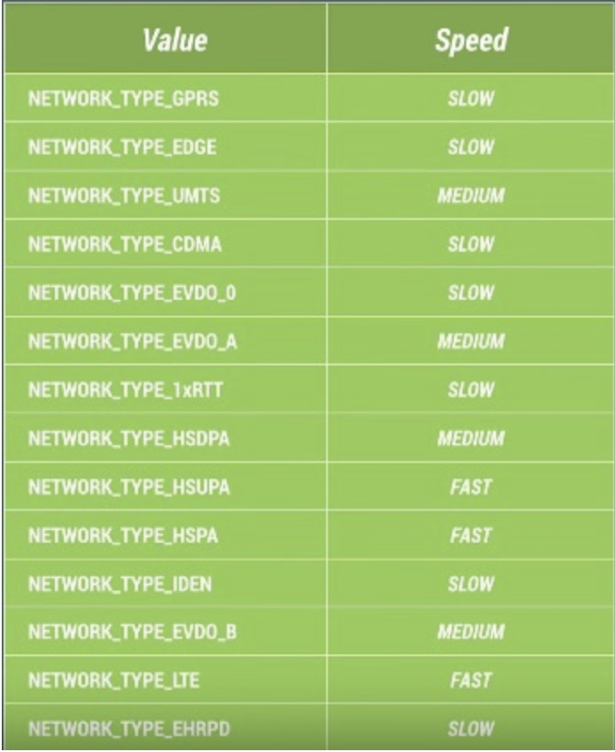
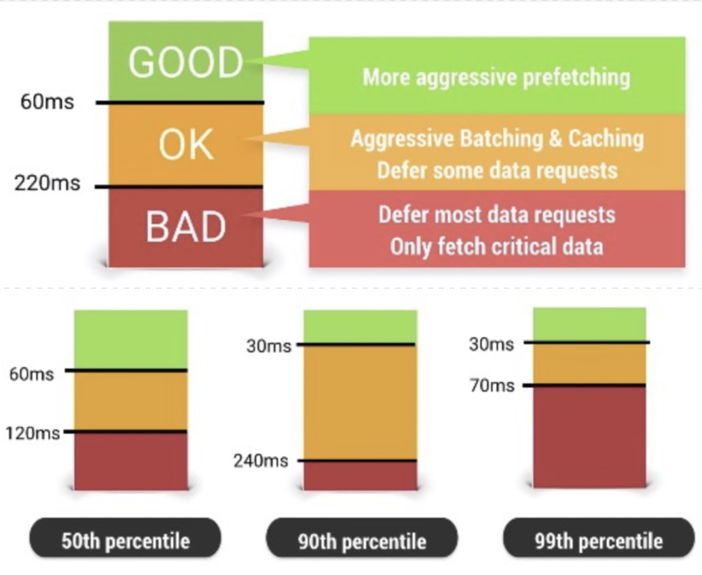
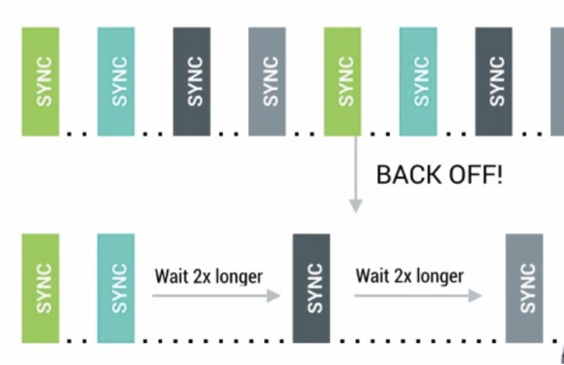
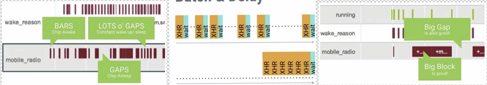
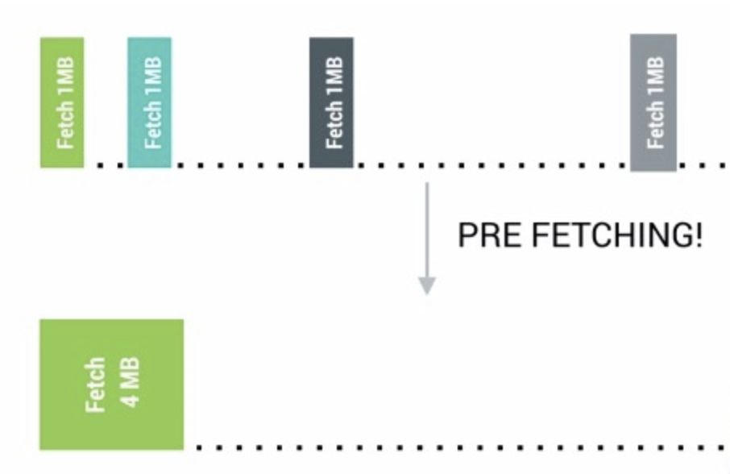
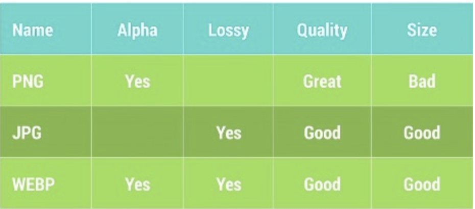

## 网络性能优化

典型的网络操作流程：

`手机端发起网络请求 <-> 到达网络服务运营商的基站 <->  转移到服务提供者的服务器上进行解码 <-> 访问本地存储数据库 <-> 进行编码，按照原来的路径逐层返回`



在上面的网络请求链路中任何一个环节都有可能导致严重的延迟，成为性能瓶颈，但是这些环节可能出现的问题，客户端应用是无法进行调节控制的，应用能够做的就只是根据当前的网络环境选择当下最佳的策略来降低出现网络延迟的概率。

主要的实施步骤有两步：

1. **检测收集当前的网络环境信息**
	
	根据当前网络速率来调整网络请求的行为
	
	
	
2. **根据当前收集到的信息进行网络请求行为的调整**

	例如把网络延迟分为三档：GOOD、OK、BAD。
	
	如果网络延迟属于GOOD的范畴，我们就可以做更多比较激进的预取数据的操作。
	
	如果网络延迟属于BAD的范畴，我们就应该考虑把当下的网络请求操作Hold住等待网络状况恢复到GOOD的状态再进行处理。
	
	前面提到说60ms，220ms是需要提前自己预测的，可是预测的工作相当复杂。首先针对不同的机器与网络环境，网络延迟的三档阈值都不太一样，出现的概率也不尽相同，我们会需要针对这些不同的用户与设备选择不同的阈值进行差异化处理。
	
	Android官方为了帮助我们设计自己的网络请求策略，为我们提供了模拟器的网络流量控制功能来对实际环境进行模拟测量，或者还可以使用AT&T提供的 Network Attenuator来帮助预估网络延迟。
	
	
	
	
**发生网络行为的三种类型：**

* 用户主动触发请求
* 被动接收服务器返回的数据
* 数据上报，行为上报，位置更新等自定义的后台操作

**网络请求场景：**

* Using URL，普通的 HTTP 请求
	
```
BitmapFactory.decodeStream((InputStream)new URL(pathToImage).getContent());
```

* Using HTTP，打开某个 URL 获取数据

```
HttpClient client = new DefaultHttpClient();
HttpGet request = new HttpGet(url);
HttpResponse response = client.execute(request);
```

### 何时发起网络请求

1. 区分网络请求，及时 / 延迟

2. 避免使用 Polling 轮训的方式执行网络请求，Android 官方推荐使用 `Google Cloud Messaging` (中国不可用)，这个框架会帮助把更新的数据推给客户端。

3. 对可延迟的网络请求行为采取策略
	* 回退机制避免固定频繁的同步请求，例如，在发现返回数据相同的情况下，推迟下次请求时间
	
		
	
	* Batch & Delay，使用 Job Scheduler，批处理的方式避免频繁的间隔请求，Google Play Service 提供了 `GCMNetworkManager` (中国不可用)帮助我们实现该功能。实现原理即：先将网络请求暂存到一个 PendingQueue 里面，等条件合适再出发 Queue 里面的网络请求。
	
		
		
	* Prefetching，预取技术，提前把一些数据拿到，避免后面频繁再次发起网络请求。同样 `GCMNetworkManager` 能帮助我们实现该功能。
	
		
	
	* 等到网络切换到 WiFi 或者处于充电的时候执行

> 有效的 Prefetching 是一个问题，预取数据量偏少，起不到频繁请求作用；请求数据过多，就会造成资源的浪费。所以，1. 在 WiFi / 4G / 3G 等不同的网络环境下设计不同的预取数据量。2. 按照图片的数量或者操作时间作为阈值。3. 根据特定的场景设计合适的方案。同理设计 Batching 确定合适的条件触发也需要考量。

### 如何传递网络数据

不同的网络环境，下载速度以及网络延迟存在差异。
	
更低的网络环境 -> 执行更长的时间 -> 更长的网络操作行为 -> 消耗更多的电量。

未经过压缩的数据、更多的网络传输量，使得用户付出更多的流量费

* 数据压缩
	
	在上传与下载数据之前，使用CPU对数据进行压缩与解压，可以很大程度上减少网络传输的时间。
	
	[CompressorHead](https://www.youtube.com/playlist?list=PLOU2XLYxmsIJGErt5rrCqaSGTMyyqNt2H)：这系列的课程会介绍压缩的基本概念以及一些常见的压缩算法知识。
	
	[Image Compression](http://www.html5rocks.com/en/tutorials/speed/img-compression/)：介绍关于图片的压缩知识。

	[Texture Wranglin](http://www.gdcvault.com/play/1020682/Texture-Wranglin-Getting-your-Android)：介绍了游戏开发相关的知识。

	[Grabby](https://www.youtube.com/watch?v=P7riQin9Bfo&feature=iv&src_vid=l5mE3Tpjejs&annotation_id=annotation_3146342489)：介绍了游戏开发相关的知识。

	[Gzip is not enough](https://www.youtube.com/watch?v=whGwm0Lky2s&feature=iv&src_vid=l5mE3Tpjejs&annotation_id=annotation_1270272007)

	[Text Compression](http://www.html5rocks.com/en/tutorials/speed/txt-compression/)

	[FlatBuffers](https://www.youtube.com/watch?v=iQTxMkSJ1dQ&feature=iv&src_vid=l5mE3Tpjejs&annotation_id=annotation_632816183)
	
* 网络传输数据量量
	
	通常来说，网络传输数据量的大小主要由两部分组成：图片与序列化的数据
	
	* 减少图片大小

		PNG，JPEG，WEBP三种主流格式在占用空间与图片质量之间的对比
		
	
	* 减少序列化数据大小
		
		JSON与XML为了提高可读性，在文件中加入了大量的符号，空格等等字符，而这些字符对于程序来说是没有任何意义的。		
		我们应该使用Protocal Buffers，Nano-Proto-Buffers，FlatBuffer来减小序列化的数据的大小。


### 缓存

想要使得Android系统上的网络访问操作更加的高效就必须做好网络数据的缓存。这是提高网络访问性能最基础的步骤之一。从手机的缓存中直接读取数据肯定比从网络上获取数据要更加的便捷高效，特别是对于那些会被频繁访问到的数据，需要把这些数据缓存到设备上，以便更加快速的进行访问。

Android系统上关于网络请求的Http Response Cache是默认关闭的，这样会导致每次即使请求的数据内容是一样的也会需要重复被调用执行，效率低下。通过以下代码开始 HttpResponseCache。

```
   protected void onCreate(Bundle savedInstanceState) {
       ...

       try {
           File httpCacheDir = new File(context.getCacheDir(), "http");
           long httpCacheSize = 10 * 1024 * 1024; // 10 MiB
           HttpResponseCache.install(httpCacheDir, httpCacheSize);
       } catch (IOException e) {
           Log.i(TAG, "HTTP response cache installation failed:" + e);
       }
   }

   protected void onStop() {
       ...

       HttpResponseCache cache = HttpResponseCache.getInstalled();
       if (cache != null) {
           cache.flush();
       }
   }
```

开启Http Response Cache之后，Http操作相关的返回数据就会缓存到文件系统上，不仅仅是主程序自己编写的网络请求相关的数据会被缓存，**另外引入的library库中的网络相关的请求数据也会被缓存到这个Cache中**。

清除 HttpResponseCache 的数据：

* 缓存溢出的时候删除最旧最老的文件
* 通过Http返回Header中的 Cache-Control 字段来进行控制的

通常来说，HttpResponseCache会缓存所有的返回信息，包括实际的数据与Header的部分.一般情况下，这个Cache会自动根据协议返回Cache-Control的内容与当前缓存的数据量来决定哪些数据应该继续保留，哪些数据应该删除。

但是在一些极端的情况下：

* 服务器返回的数据没有设置Cache废弃的时间
* 本地的Cache文件系统与返回的缓存数据有冲突
* 某些特殊的网络环境导致HttpResponseCache工作异常

在这些情况下就需要我们自己来实现Http的缓存Cache。

实现自定义的http缓存，需要解决两个问题：

1. 第一个是实现一个DiskCacheManager，
2. 另外一个是制定Cache的缓存策略。

关于DiskCacheManager，我们可以扩展Android系统提供的DiskLruCache来实现。而Cache的缓存策略，相对来说复杂一些，我们可能需要把部分JSON数据设计成不能缓存的，另外一些JSON数据设计成可以缓存几天的，把缩略图设计成缓存一两天的等等，为不同的数据类型根据他们的使用特点制定不同的缓存策略。

