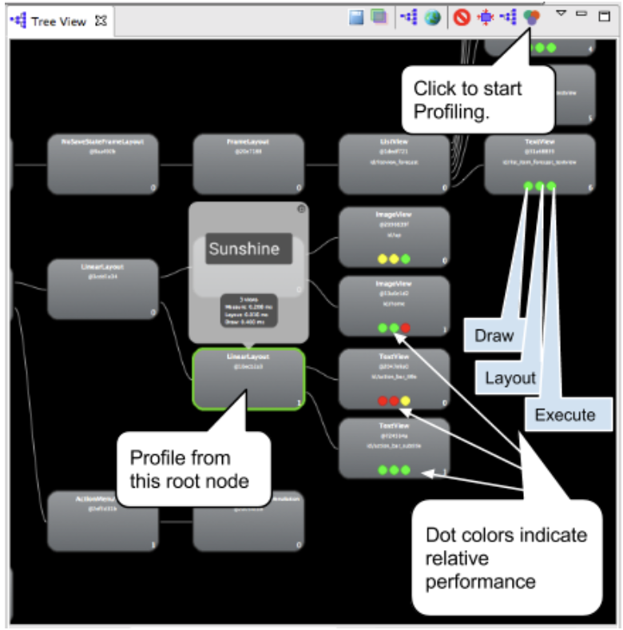

# 渲染性能

## 0x01 背景概念
* **Video 视象**，由一系列叫做“帧”的独立图片组成的。平滑的动画一般需要每秒60帧(人眼与大脑之间的协作无法感知超过60fps 的画面更新)。
* **Frame 帧**，由像素点构成，当屏幕绘制一帧的时候，像素点是一行一行的进行填充的。
* **vSync 垂直同步**，显示屏从 GPU 获取每一帧的数据，然后一行一行进行绘制。理想状态下，显示屏在绘制完一帧后，GPU 正好能提供新帧的数据。**图像撕裂**的状况就发生在图形芯片在图像绘制到一半的时候，就载入了新一帧的数据，以致于最终得到的数据帧就是半个帧的新数据半个帧的老数据。而，vSync 就是告知 GPU 需要等待屏幕绘制完成前一帧才能载入新帧。Jelly Bean 开始垂直同步脉冲会贯穿于所有的图形运作过程。
* **Frame Rate 帧率**，代表 GPU 在一秒内绘制操作的帧数，例如60fps(Frame Per Second) 每秒绘制60帧。
* **Refresh Rate 刷新率**，代表屏幕在一秒内刷新屏幕的次数，取决于硬件的固定参数，例如60HZ每秒刷新60次
* **Resterization栅格化**，是绘制那些 Button，Shape，Path，String，Bitmap 等组件最基础的操作。它把那些组件拆分到不同的像素上进行显示，这是一个很费时的操作，GPU 的引入就是为了加快栅格化的操作。
    	
## 0x02 Android UI 渲染流程

 
**CPU 负责把 UI 组件计算成 Polygons/Texture 纹理保存在 DisplayList 中 -> GPU进行栅格化渲染 -> 屏幕上显示**
    
* CPU负责包括 Measure，Layout，Record，Execute 的计算操作，GPU 负责 Rasterization 栅格化操作等。
* CPU 转移到 GPU是个很麻烦的事，所幸 OpenGL Es 可以把哪些需要渲染的纹理Hold 在GPU Memory 里，下次需要渲染的时候直接进行操作，但是如果更新了 GPU 所 hold 的纹理内容，那么之前保存的状态就丢失了
* Android 需要把 XML 布局文件转换成 GPU 能够识别并绘制的对象。这个操作是在 DisplayList 的帮助下完成的。
    * DisplayList 持有所有将要交给 GPU 绘制到屏幕上的数据信息。
    * 在某个View 第一次需要被渲染时，DIsplayList 会因此被创建，当这个 View 要显示到屏幕上时，我们会执行 GPU 的绘制指令来进行渲染。如果后续要移动这个 View 等操作而需要再次渲染这个 View 时，我们就仅仅需要额外操作一次渲染指令就够了。如果修改了 View 的可见性或者内容发生变化时，都会中心执行创建 DisplayList，渲染 DisplayList，更新到屏幕上等一些了操作。
    * 这个流程的表现性能取决于你的 View 的复杂程度，View 的状态变化以及渲染管道的执行性能。举个例子，假如某个 Button 的大小需要增大到目前的两倍，在增大 Button 大小之前，需要通过父 View 重新计算并摆放其他子 View 的位置。修改 View 的大小会触发整个 HierarchyView 的重新计算大小的操作。修改 View 的位置则会触发 HierarchyView 充新计算其他 View 的位置。
    * 如果布局复杂，很容易导致性能问题，我们应尽量减少 Overdraw。      
    
    	
    	
## 0x03 运行机制
GPU(Graphics Processing Unit)会获取图形数据进行渲染。然后硬件负责把渲染后的内容呈现到屏幕上，二者不停的进行协作。

但是，如果刷新频率和帧率不能保持相同的节奏工作时，就会出现 Tearing 的现象。

当帧率比刷新频率快时，通常标准帧率60fps，即当>60fps时，GPU 所产生的数据会因为等待 VSYSNC 的刷新信息而被 Hold 住，这样就能保证每次刷新都有实际的新数据可以显示。

当帧率比刷新频率慢时，即<60fps时，某些帧的显示画面就会和上一帧的画面相同，发生卡顿掉帧的不顺滑的情况。

除了垂直同步外，Android 还使用了缓冲的方式使动效更顺畅。

Android 采用**双缓冲机制**，在显示一帧的同时进行另一帧的处理。缓冲就是帧构建和保存的容器，缓冲 A 和 B，当显示缓冲 A 时，系统在缓冲 B 中构建新的帧，完成后则交换缓冲。显示缓冲 B，而 A 则被清空，继续下一帧的绘制。

当某帧的绘制时间超过 16ms 时，双缓冲就会导致，一步慢步步慢的情况。为此引入**三缓冲**，在 B 缓冲超时，而 A 缓冲用于当前帧的显示中，系统会创建缓冲 C，并继续下一帧的工作。三倍缓冲结束了频繁卡顿的产生，在初始化跳顿后，用户得到了平滑的动画效果。即使有些问题发生了，但系统还是会努力给用户满意的结果。

但是，系统没有一直使用三倍缓冲，因为三倍缓冲在整个过程中引入了一些输入延迟。所以出现某些错误行为时，你有两个选项：输入延迟(触摸操作生效时间延长)或者画面卡顿。为解决这个问题，没有一直使用三倍缓冲，一般情况下，只使用了双缓冲，当需要的时候用三倍缓冲来进行增强。
    	
## 0x04 造成渲染性能的原因

CPU 或 GPU 负载过量，导致 16ms 内没有渲染完成。CPU 通常存在的问题的原因是存在非必须的视图组件，它不仅仅会带来重复的计算操作，而且还会占用额外的 GPU 资源

## 0x05 工具检查

### 1. [HierarchyViewer](https://developer.android.com/studio/profile/hierarchy-viewer?hl=zh-cn) 查看布局树结构
	

	
* 配置环境变量`export ANDROID_HVPROTO=ddm`
* Window > Open Perspective

### 2. 开发者选项 Show GPU Overdraw 查看视图重绘

### 3. 开发者选项 Profile GPU Rendering 查看渲染时间

### 4. 开发者选项 Show GPU view updates 查看视图更新操作

界面发生更新操作进行闪烁

### 5. Lint

Android Studio -> Analyze -> Inspect Code 

### 6. [TraceView](https://developer.android.com/studio/profile/traceview#profile_pane)
	
**方式一：代码 Debug.startMethodTracing/stopMethodTracing**

这俩个函数运行过程中采集运行时间内该应用的所有线程(只能是 Java 线程)的函数执行情况，最后生成.trace文件保存在/mnt/sdcard/android/package/files文件夹中。利用TraceView工具分析数据
    
**方式二：DDMS**
    
 
    
  列名 | 描述
  --- | ---
  Name | 该线程运行过程中所调用的函数名
  Incl Cpu Time | 某函数占用的 CPU 时间，包含内部调用其它函数的 CPU 时间
  Incl Real Time | 同Incl Cpu Time，统计单位为真实时间 ms
  Excl Cpu Time | 某函数占用的 CPU 时间，不包含内部调用其它函数的 CPU 时间
  Excl Real Time | 同Excl Cpu Time ，统计单位为真实时间 ms
  Call + Recur Calls/Total | 某函数被调用次数以及递归调用占总调用次数的百分比
  Cpu Time/Call | 某函数调用CPU 时间与调用次数的比，相当于该函数平均执行时间
  Real Time/Call | 同 CPU Time/Call，统计单位为真实时间 ms
  
### 7. [Systrace](https://source.android.com/devices/tech/debug/systrace#example_1) 

**方式一：命令行**
  
/sdk/platform-tools/systrace
  
`python ./systrace.py [options] [categories]`
  
通用的命令：
`python ./systrace.py -t 10 -a <package_name> -o xxtrace.html app sched gfx view am wm dalvik binder_driver freq idle load sync`
  
**方式二：DDMS**
  

  
生成.html文件，在浏览器中打开
  

  
  颜色 | 状态
  --- | ---
  灰色 | Sleeping
  蓝色 | Runnable 可以运行但是需要等待调度唤醒
  绿色 | Running
  橙色 | uninterruptiable sleep 由于 I/O 负载而不可中断休眠
  
  尤其关注 Runnable，很可能wake by pid xxx，cpu 此时被 xxx 进程抢占着，查看这个进程是否有异常
  
## 0x06 优化技巧
 * 重绘问题 GPU
   * 非必须重叠背景
     * Activity 有自己的背景，Layout 又有自己的背景 
     * 移除 Window 默认的 Background
     * 移除 XML 布局文件中非必须的 Background
     * 按需显示占位背景图片，避免 ImageView 存在资源背景两个而导致的过度渲染，通过代码判断获取 Bitmap 资源隐藏背景，否则显示。
   * 非可见 UI 不绘制
     * 对于重写了 onDraw()，系统无法检测出具体在 onDraw 里面会执行什么操作
     * clipRect()，帮助系统识别可见区域，区域之外的内容不绘制
     * quickReject，判断是否和某个矩形相交
 * 性能问题 CPU
   * 布局扁平化，尽量少嵌套，减少 Measure Layout计算时间
   * 避免 onDraw() 方法内创建对象，导致频繁的创建对象占用内存，建议写在代码块中
   * 谨慎使用 invalidate()，只有在 view 发生改变时才调用
   * 对 Bitmap 进行选择缩放等操作时，尽可能选取小的 Bitmap
   * 尽量减少每次重绘的元素，比如将背景单独拎出来设置为一个独立的 View，通过 setLayerType() 方法使得这个 View 强制用 HardWare() 进行渲染
   * 动画尽量使用 PropertyAnimation 和 ViewAnimation 来操作实现，Android系统会对这些 Animation 做一定的优化处理。
   * alpha View 加重性能。对于不透明的 View，只需要渲染一次，可是如果设置了 alpha，至少会渲染俩次，因为需要结合上层的 View 进行 Blend 混色处理。默认渲染顺序：从下向上，从底到顶。
     * 存在层叠，例如 ListView 不同做 Blending 操作，会导致不少性能问题，使用ViewPropertyAnimator.alpha().withLayer() 指定 GPU 渲染
     * 不存在层叠，即阴影，需要通过重写hasOverlappingRendering()告知系统

